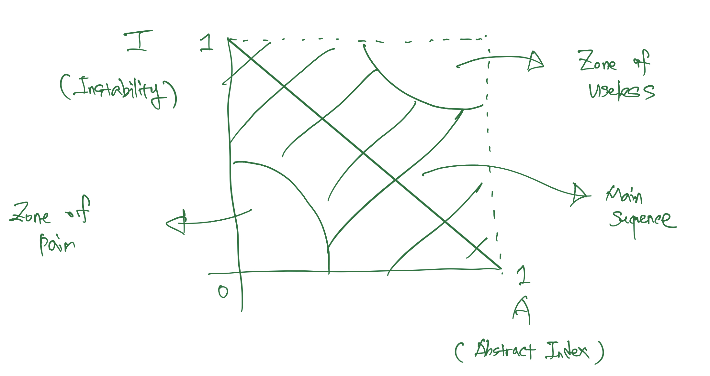
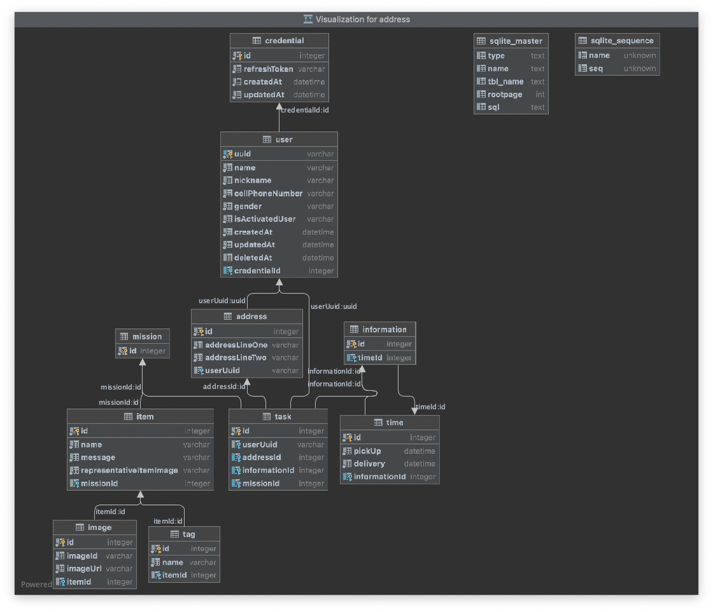
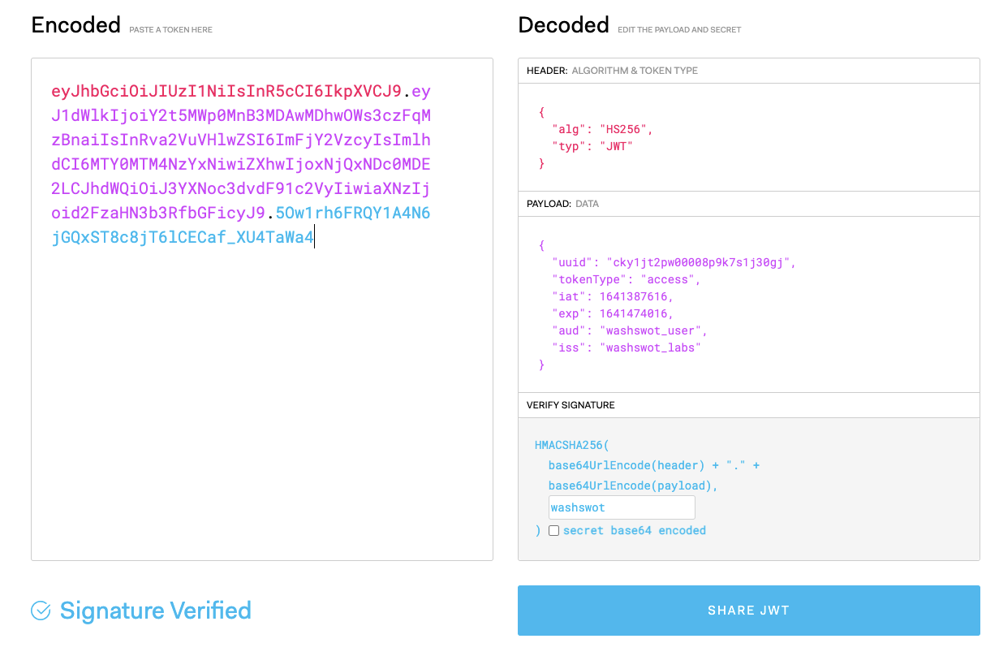

# 시작하면서

안녕하세요 지원자 여러분! 세특 nodejs 과제 테스트에 참여 해주셔서 감사 드립니다. 해당 과제는 세특 앱에서 활용 하고 있는 "문제 의류 접수" 화면의 API를 작성 하는 프로젝트 입니다. 각 컴포넌트들을 잘 구조화 활 수 있는지, OOP 기반의 프로그래밍을 하실 수 있는지 또 지금은 작은 프로젝트라도 확장성이 고려된 프로젝트를 완성 시킬 수 있는지? 를 파악하는 것에 목적으로 두고 있습니다. 프로젝트 구조화에 신경 써주셨으면 좋겠습니다.

**해당 프로젝트 clone 후 새롭게 작성 해주세요.**
기타 자세한 프로젝트 설명과 과제에 대한 내용은 [노션페이지](https://washswat.notion.site/NodeJS-a16cd2078a3c4b38a7e8df6de875e890) 를 참고 해주세요.

---

# 세탁특공대 의류 접수앱

세특 고객들이 의류를 선택 해서 주문을 만들 수 있는 앱 입니다.

---

# 프로젝트에 대한 설명
- 해당 README.md 파일은 프로젝트에 대한 전체적인 설명이 기재된 파일입니다. 이와 별도로 하루하루 개발하면서 개발 과정들을 작성한 기록들을 [daily-development-log](./daily-development-logs) 라는 directory 에 날짜별로 작성해놓았습니다.
  - 해당 날짜별 기록은 [notion](https://pravdakracota.notion.site/8dc9666b2e0d49a68ca6aa12cdb2b9d5) 을 통해 기록한 걸 markdown format 으로 추출한 것이라, notion 에 들어가서 확인하시는 게 더욱 편하지 않을까 생각합니다. 
    - 헤딩 내용들이 담긴 [notion 링크](https://pravdakracota.notion.site/8dc9666b2e0d49a68ca6aa12cdb2b9d5) 를 걸어드립니다.  

---

## 프로젝트 구조와 설계 전반

### 프로젝트 구조

**전체적인 구조**

```text
├── components
│   ├── address
│   │   ├── abstracts
│   │   ├── dto
│   │   ├── repositories
│   │   └── tests
│   ├── auth
│   │   ├── abstracts
│   │   ├── dto
│   │   ├── errors
│   │   ├── interface
│   │   ├── services
│   │   ├── strategies
│   │   ├── tests
│   │   └── types
│   ├── credential
│   │   ├── abstracts
│   │   ├── dto
│   │   ├── repositories
│   │   ├── services
│   │   └── tests
│   ├── image
│   │   └── abstracts
│   ├── information
│   │   └── abstracts
│   ├── item
│   │   └── abstracts
│   ├── mission
│   │   └── abstracts
│   ├── tag
│   │   └── abstracts
│   ├── task
│   │   ├── abstracts
│   │   ├── dto
│   │   └── errors
│   ├── time
│   │   ├── abstracts
│   │   ├── mocks
│   │   └── tests
│   └── user
│       ├── abstracts
│       ├── dto
│       ├── errors
│       ├── repositories
│       ├── services
│       ├── tests
│       └── types
├── constants
│   ├── abstracts
│   ├── mocks
│   └── types
├── database
│   └── entities
└── middlewares
    └── response-wrappers
```

`src` directory 구조입니다. component based 로 되어있습니다. 해당 component 들은 역할과 책임, 그리고 행위에 기반한 domain object(entity)를 도출하고, 해당 entity 를 통해서 use case 들을 처리하기 위한 service logic method 들을 추가하는 형식으로 작업을 진행하였습니다.

---

**Controller 가 없는 component**

```tsx
export abstract class AbstractService {}
```

```tsx
export abstract class AbstractAddressService extends AbstractService {
  public abstract createAddress(createAddressDto: CreateAddressDto): Address;
}
```

```tsx
export class AddressService extends AbstractAddressService {
  constructor(private addressRepository: AbstractAddressRepository) {
    super();
  }

  public createAddress(createAddressDto: CreateAddressDto): Address {
    try {
      return this.addressRepository.createAddress(createAddressDto);
    } catch (e) {
      throw e;
    }
  }
}
```

각 component 들은 `constants/abstracts` 에 있는 `abstract.{layerName}.ts` 라는 파일을 기반으로 하여 `abstract.{domainName}.{layerName}.ts` 라는 파일들을 기반으로 추상화가 진행되고 있습니다. 예시를 위해 `address` domain 의 service layer 의 추상화 진행 과정을 가져와 봤습니다.

---

**controller 가 있는 component**

```tsx
export class UserComponent extends AbstractComponent {
  constructor(private userController: AbstractUserController) {
    super();
  }
  getController(): AbstractUserController {
    return this.userController;
  }
}
```

```tsx
export class UserController extends AbstractUserController {
  private readonly userRouter;
  constructor(private readonly userService: AbstractFacadeUserService) {
    super();
    this.userRouter = Router();
    this.initializeRouter();
  }

  public initializeRouter() {
    const router = Router();
    const path = '/user';

    router.post('/', async (req, res) => {
      try {
        const createUserDtoWithAddressInformation = req.body as CreateUserDto &
          CreateAddressDto;
        const result = await this.userService.insertUser(
          createUserDtoWithAddressInformation,
        );
        res.status(201).send(
          successResponseWrapper<AccessAndRefreshTokenInterface>({
            message: 'success signing up',
            statusCode: res.statusCode,
            data: result,
          }),
        );
      } catch (e) {
        throw e;
      }
    });

    router.get(
      '/me',
      passport.authenticate(WashSwotStrategy, {
        session: false,
      }),
      async (req, res) => {
        const { uuid } = req.user as AuthorizedUserInterface;
        const user = await this.userService.findUserByUUID({ uuid });
        res.status(200).send(
          successResponseWrapper<User>({
            message: `success getting an user's information`,
            statusCode: res.statusCode,
            data: user,
          }),
        );
      },
    );

    this.userRouter.use(path, router);
  }

  public getRouter() {
    return this.userRouter;
  }
}
```

```tsx
export class FacadeUserService extends AbstractFacadeUserService {
  constructor(
    private readonly userService: AbstractUserService,
    private readonly credentialService: AbstractCredentialService,
    private readonly addressService: AbstractAddressService,
    private readonly authService: AbstractAuthService,
  ) {
    super();
  }

  public async insertUser(
    createUserDtoWithAddressInformation: CreateUserDto & CreateAddressDto,
  ): Promise<AccessAndRefreshTokenInterface> {
    const { addressLineOne, addressLineTwo, ...createUserDto } =
      createUserDtoWithAddressInformation;
    const user = this.userService.createUser(createUserDto);
    // add address entity
    user.addresses = [
      this.addressService.createAddress({
        addressLineOne,
        addressLineTwo,
      }),
    ];
    // create access token
    const accessToken = this.authService.createAccessToken({
      uuid: user.uuid,
      tokenType: 'access',
    });
    // create refresh token
    const refreshToken = this.authService.createRefreshToken({
      uuid: user.uuid,
      tokenType: 'refresh',
    });
    // add credential entity
    user.credential = this.credentialService.createCredential({
      refreshToken,
    });
    // save user and user-related entites
    await this.userService.saveUser(user);
    // return access token as a result of successful signup
    return { accessToken, refreshToken };
  }

  public async findUserByUUID(findUserByUuidDto: FindUserByUuidDto) {
    const { uuid } = findUserByUuidDto;
    return await this.userService.findUserByUUID({ uuid });
  }
}
```

component 중에서 repository / service layer 뿐만이 아니라 Network transaction 을 위한 endpoint 가 필요한 경우엔 `{domainName}.controller.ts` 라는  controller layer 를 같이 만들어주었습니다. 해당 component 는 `{domainName}.component.ts` 라는 파일로 repository, service, controller 파일을 반환합니다.

해당 component 가 다른 것들에 의존한다면 (ex. An user has many addresses, An user has a credential), 해당 component 의 service layer 와 별개로 `facade.{domainName}.service.ts` 라는 `facade pattern` 을 사용하여 필요한 service logic 들을 `dependency injection pattern` 을 통해 주입하는 식으로 특정 domain 의 각 layer class 의 `Single Responsibility` principle 를 최대한 지키고자 노력하였습니다.


---

## 주요 체크 포인트들을 지키기 위해 한 일들
### 개발 요소들이 재사용될 수 있는 프로그래밍

**현재까지 한 일**

- 먼저 role, responsibility, method, 그리고 use cases 를 기반으로 domain object / entity 를 설계하였고, service layer 의 interface / abstract class 를 설계하였습니다.
- 위의 domain object / entity 를 기반으로 어떤 component 가 필요한지를 나누었습니다. 각 component 의 경우는 3 tier layer 를 기반으로 하였고, 그 세 개의 layer class 를 component 단위로 묶어내는 방식으로 구성하였습니다.
- 또한, SOLID 에 기반하여 각 component 의 layer 를 변경될 이유가 하나뿐일 수 있게끔 설계하였고, DI(`dependency injection`) pattern 을 통해서 각 layer 간의 의존성 또한 느슨하게 만들어주었습니다.
  - 그리고 이렇게 여러개의 service class 들을 `facade` pattern 을 통해 하나로 묶어내고 외부로 굳이 노출시킬 필요가 없는 method 들의 경우는 `private method` 로 내부적으로 처리를 하였습니다.
  - 다음으로는 `facade pattern` 처럼 private method 들을 사용하여 내부적인  처리 결과들을 조합한 뒤, 결과값을 반환하는, controller 에서 필요한 만큼의 public method 만을 남겨두는 식으로 (facade) service class 를 구성하였습니다.

**좀 더 점검하면 좋을 부분**

- service layer 와 repository layer 의 책임이 모호한 부분이 많아 수정이 필요하다는 생각이 듭니다.
  - 특히, `order` 같은 경우 막판에 빠르게 개발하려고 하다보니 책임 소재가 뒤죽박죽인 경우가 보인다. repository layer 는 database i/o 를 통해서 값을 가지고 오고, 그를 의미가 있는 domain object / entity 로 wrapping 해 주는 것이 해당 layer 의 책임이라고 생각하는데, service layer 에서 repository layer 의 책임을 가져가고 있는 부분들을 파악하였습니다.

---

### 확장성을 가진 프로젝트 구조

**현재까지 한 일**

- 최대한 `SOLID` principle 를 위배하지 않도록 설계 / 구현을 진행하였습니다.
  - `SOLID` 는 좋은 아키텍처를 위한 원칙들인 `Single Responsibility`, `Open-Closed`, `Liscov substitution`, `Interface segregation`, `Dependency Inversion` 들로 만든 acronym 입니다.
    - Single Responsibility: 하나의 class 가 바뀌어야 할 이유는 하나뿐이도록 설계를 하였습니다. 그렇게 해서 많아진 class 는 facade pattern 을 통해 캡슐화를 하면서 관리하였습니다. 제출한 과제의 codebase 에서는 `facade.*.service.ts` 파일들이 해당 역할을 하고 있습니다.
    - Open-Closed: 개방에는 열려있으나, 변화에는 폐쇄적이도록 설계하였습니다. 이는 `abstract*`, `abstract{domainName}*`, `{domainName}*` 순으로 단계적 추상화를 진행하고, 해당 abstract class 들에서 반드시 갖추어야만 하는 abstract method 들을 정의하는 방식으로 접근하였습니다.
      - 개방에는 자유롭게 (abstract class 에서 정의한 abstract method 만 구현하면, public / private 과 무관하게 method 들을 경우에 따라 확장이 가능하다)
      - 수정에는 폐쇄적이게(abstarct method 를 통해 어떤 type의 input 이 들어가고, 어떤 type 의 output 이 나가는지를 정의해놓았기에, 수정을 하기엔 쉽지 않다)

      시스템을 설계하였다.

    - Liscov Substitution: 이는 ‘농부의 자식 또한 농부의 아버지처럼 농사를 지을 수 있어야한다’ 라는 예시 설명이 가능한, 어떠한 class 가 parent class 의 subclass 이기 위해서는, parent class 대신 투입하여도 아무런 문제가 없이 기능을 수행해야 한다는 요구조건이 담긴 원칙입니다.
      - 해당 원칙을 위배하는 경우는 복잡한 상속관계입니다. 상속 관계가 복잡해지다 보면, 어떤 class 가 어떤 class 의 subclass 인지 파악하기가 어려워지고, 해당 principle 을 지키기가 어려워지기 때문입니다.
      - 그래서 이를 만족시키기 위해 코드를 작성할 때에는 abstract - concrete class 를 위한 extends 를 제외하곤 최대한 상속을 지양하였다. 상속을 통해 가져오는 의존성들은 의존성 주입 패턴(`Dependency Injection` pattern)으로 의존성을 외부에서 주입해주는 방식으로 해결하였다.
    - Interface Segregation: 사용하지 않는 method 를 가지고 있는 상황을 만들어서는 안 된다는 원칙입니다. 이를 위해서 커다란 하나의 interface 를 다양한 interface 로 나누고, 이렇게 다양하게 나누어진 interface 들을 관리하기 위해 `(abstract) factory pattern` 을 활용하는데, 이번엔 interface 의 규모가 크지 않아서 추상화를 진행하고 concrete class 를 만들 때 하나의 abstract clsss 만을 활용하게 되어서 해당 원칙을 크게 위배하지는 않았습니다.
      - 또한, 이번 과제의 조건으로 인해 해당 원칙을 크게 위배할 여지 또한 없었습니다.
        - 먼저, compiled language 가 아닌 script language 인 javascript 와 그의 superset 인 typescript 로 codebase 를 작성하고 있었다는 점입니다.
        - Interface Segregation 은 사용하지 않는 method 를 가지고 있는 interface 를 통해 만들어진 어떤 class 가, 그 사용하지 않는 interface 가 변경이 될 때 해당 class 또한 불필요한 build - compile 이 이뤄지는 상황을 막아보자는 취지로 만든 요건이 큽니다. 그러나, 애초에 script language 에서는 build - compile 과정이 없으니 해당 문제로부터 상대적으로 자유로운 편입니다.
        - 물론, `TypeScript` 라는 superset 은 compile 까진 아닌 아닌 transpile 을 진행하긴 하지만, 상술한 것처럼 interface 의 규모가 아직까지는 크지 않다는 조건 덕에 codebase 가 해당 원칙을 위배하지는 않았습니다.
    - Dependency Inversion: 직역하자면 ‘의존성의 역전’ 이라는 말입니다. 3 tier layer architecture 로 예시를 들자면, controller 는 service 에, service 는 repository 에 의존성을 가지고 있는 상태입니다. 그러나, 의존하고 있는 layer 가 abstract class / interface 형식이라면, 앞에 말했던 경우의 의존성 방향과는 반대로 피 의존 layer 가 의존 layer 에게 어떤 concrete class 를 올려보내줄지를 지정해 주기 때문에, 의존성이 기존의 방향과 반대로 흘러가게 됩니다.
      - 해당 조건은 `abstract class` 를 통해 추상화를 진행하였기에 크게 위배하지 않고 codebase 를 작성할 수 있었습니다.
- concrete class 가 아닌, `abstract class` 를 기반으로 추상화를 진행하였습니다.
  - 그 덕분에 IoC(`Inversion of Control`) 이 용이해졌습니다.
    - IoC 가 용이해진 만큼 mocking 등이 쉬워져, 좀 더 테스트가 쉬운 구조를 만들 수 있었습니다.
      - 이를 통해 각 component 와 각 component 의 layer 를 작업할 때에는
        - test code 를 작성
        - test driven development 방식으로 작업

        을 하여, 좀 더 용이하게 작업을 할 수 있었습니다.

  - 추상화와 테스트를 통해 확장성을 가진 프로젝트를 만들었다고 이야기하고 싶은 근거는 이렇습니다.
    - 추상화: injection 으로 주입한 type 들이 concrete class type 이 아니라 abstract class / interface type 이기에, type 을 반환하는 같은 method 들을 구현해 놓은 concrete class 라면 유연하게 교체가 가능하여 프로젝트의 확장성이 증가합니다.
    - 테스트: 테스트는 확장을 하는 데 드는 비용의 감소라는 효용을 가져다준다고 생각해서 확장성을 가진 프로젝트를 위한 노력으로서 기재해 보았습니다. 그리고 원활한 test 를 위해서 하나의 함수가 하나의 역할만을 하게끔 method 를 설계하면, 재사용성 또한 자연스레 높아진다고 생각합니다.

**좀 더 점검하면 좋을 부분**

- additional test code implementation: order component 와 해당 subcomponent 들은 time component 를 제외하고는 test code 를 작성하지 못 한 채로 구현에만 집중하여 test code 가 전무한 상황입니다. 그리고 기존 abstract class 의 abstract method 를 수정하다 보니, 새롭게 추가해야 하는 test code 도 생겼습니다.
- 과도한 추상화를 하지 않았나 점검해보기:

  

  - no silver bullet (모든 상황에서 모든 걸 다 해결해주는 만능 해결책은 없다)라는 격언과 마찬가지로, 추상화라는 것이 어떤 상황에서든 ‘소프트’웨어를 유연하고 확장 가능한 구조로 만들어주는 만능 해결책은 절대로 아닙니다. ‘무엇이든 적당히’ 라는 말처럼, 추상화에도 적절한 추상화 단계라는 게 필요합니다.
  - 적절한 추상화 단계의 기준이란, ‘안정적일 수록 추상적이어야한다’ 라는 대 원칙에서 출발합니다. 안정적이라는 것은 그만큼 많은 component 들이 해당 component 에 의존하고 있다는 이야기입니다. 안정적이기에, 다른 component 들의 의존들을 받아낼 수 있는 것입니다.
  - 나중에 요구사항의 변경 등으로 위의 component 들을 확장시켜야 하는 상황이 왔을 때, 해당 component 가 concrete component 라면 그 component 를 참조하는 다른 component 들을 전부 변경해 주어야 합니다.
  - 이런 상황에 지출해야 하는 비용을 줄이기 위해서 적절한 추상화라는 목표를 가지고 component 를 면밀히 점검하는 과정은 안정적인 아키텍처를 고려했을 때 매우 중요한 부분입니다.
  - 해당 그림은 component level 에서 우리가 지양해야 할 추상화 정도와 지향해야 할 추상화 정도를 대략적으로 알려주는 척도라고 할 수 있습니다. 각 component 의 `(a, i)` 값이 저 main sequence 부근에 최대한 가깝게 위치하게끔 component 의 불안정성과 추상화정도를 조정해야 할 필요가 있습니다.
    - 먼저, x 축에 있는 A(`abstract index`) 라는 값은 어떤 component 의 추상화 지표를 의미합니다. 이는 `A = NumberOfConcreteClass / NumberOfAbstractClass + NumberOfInterface`
      라는 공식으로 해당 지표의 계산이 가능합니다.
      - 다시 말해, 한 component 를 이루고 있는 concrete class 의 갯수를 한 component 의 abstact class + interface 의 갯수의 합으로 나누는 방식입니다.
    - 그 다음으로, y 축에 있는 I(`instability`) 라는 값은 어떤 component 의 불안정성 지표를 의미합니다. `Instability = Fan-out / Fan-out + Fan-in` 라는 공식으로 해당 지표의 계산이 가능합니다.
      - 해당 component 가 참조하는 component 를 `fan-out`, 해당 compoent 가 참조하는 component 의 갯수를 `fan-in` 이라고 한다.
      - 간단하게 말하자면, 해당 component 가 다른 component 들에 얼마나 많이 의존하고 있는지를 계산하는 계산식이라고 할 수 있습니다. 의존받는 비중보다 의존하는 비중이 더 클 수록, 해당 component 는 불안정하다고 할 수 있다.
  - 현재 작업을 하면서 기본적인 수준들에 대해서는 기계적으로 각 layer 들을 abstract class 를 기반으로 추상화를 시켜놓았는데, 이게 적절한 수준의 추상화가 맞는지 점검해야 할 필요성은 있다는 생각이 들었습니다.

---

### 데이터베이스 구조화

**현재까지 한 일**

- 정규화
  - 정규화단계는 3.5 NF (Boyce-Codd NF) 까지 진행하였습니다. 이유는 데이터베이스에 담길 데이터들의 integrity 와 consistency 를 최대한 유지하기 위해서입니다. 특히 transitive functional relation 관계가 있는 subset 들을 묶어서 별도의 table 로 분리하는 과정에 집중했었습니다.
    - 해당 과정의 대표적인 결과물은 주소(address)를 별도의 table 로 분리한 것입니다.
    - 분리한 이유는 [API Sample data](https://s3.ap-northeast-2.amazonaws.com/com.washswat.assets/dev/rn.json) 를 보았을 때, `address_01` 과 `address_02` 부분이 transitive functional relation 이 있다고 판단하였기 때문입니다.
      - `address_01`, 그러니까 흔히 우리가 일컫는 도로명 주소가 바뀌는 경우, `address_02`, 흔히 말 하는 동/호수를 적는 상세주소가 바뀔 확률은 매우 높다고 생각합니다.
        - 물론, 다른 위치에 같은 동/호수가 있는 경우가 있을 수 있지만, 그 경우의 확률은 매우 적다고 생각했습니다.
      - 그래서 `information` 이라는 data 를 구성하는 `address_01` 과 `address_02` 라는 두 개의 column을 별도의 `address` 로 분리하였습니다.
  - 이런 분리를 하게 된 이유가 또 하나 있는데, 바로 UX 관점입니다.
    - 사용자의 입장에서는 이전에 주문을 했던 주소로 세탁 주문을 맡기고 싶을 때, 그 주소지를 주소지를 새로 입력해야 한다면 썩 유쾌한 경험은 아닐 것이라는 생각이 들었습니다.
    - 그리고 위의 방법보다는,
      - 내가 이전에 주문했던 주소지 목록들 중에 하나를 선택해서 그 주소를 입력할 수 있다면
      - 수정하더라도, 그 주소를 불러와서 수정할 부분만 수정할 수 있다면
      - 더 이상 쓰지 않는다면, 그 주소지 항목을 내 주소지 목록에서 삭제할 수 있다면

      좀 더 편하지 않을까? 라는 생각을 하며 분리를 진행하기 하였습니다.

  - 그래서, `user` 라는 table 과 `a user has many address` 라는 relation 을 만들어 주어야겠다는 생각을 하여서 위 두 개의 table 은 자연스럽게 분리가 이뤄졌습니다.

- credential table
  - 그 다음으로는 `credentials` 라는 table 을 만든 것입니다.
  - 이는 access - refresh token pair 를 통해 인증을 진행하기 위해서 만든 table 입니다. 해당 table 은 access token 이 만료가 되었을 경우, refresh token 을 통해 access - refresh token pair 를 갱신하고, 그 갱신된 결과를 담는 역할을 합니다.
  - 부수적으로는, 사용자 별 마지막 로그인 날짜를 파악할 수 있는 역할도 합니다. refresh token 은 ‘자동 로그인 주기’ 라는 UX 와 관련된 부분과 연관이 있기 때문입니다.
    - 왜냐면, access token 을 통한 자동 로그인 주기가 끝났을 때, 다시 로그인을 하기 위해서는 refresh token 을 통해 새로 갱신을 해야 하기 때문입니다.
  - 그래서 refresh token 의 갱신일이 `현 시점 - refresh token 만료일` 보다 이전이라면, 이 사람은 최근에 애플리케이션을 잘 사용하지 않았다는 걸 유추할 수 있습니다.
  - 그런 사람들을을 조건을 통해 정리하고, 그 사람들이 왜 잘 사용하지 않았는지에 대해 그 사람들과 관련된 나머지 데이터를 통해 분석하면, 어떤 식으로 retention 을 진행해야 가장 효율적으로 진행할 수 있을 지에 대해 논의하는 상황 등에서 데이터를 기반으로 한 논의 (data driven decision) 가 가능해지는 여지를 남길 수 있다고 생각하였습니다.


**좀 더 점검하면 좋을 부분들**

- ORM 사용으로 인한 trade off 파악 및 대책 보완
  - 저는 `better-sqlite3` 와 `sqlite3` , 그리고 `TypeORM` 을 사용하여 작업을 진행하였습니다.
  - 우선, ORM 을 사용하면서 얻을 수 있는 장점은 다음과 같습니다.
    - 첫째로는 빠른 개발 속도이다.
      - 아무래도 codebase 를 구성하는 프로그래밍 언어만으로 database io 의 대부분을 제어할 수 있다보니, 코드 중간중간마다 raw query 를 사용하는 것보다는 개발 속도가 빨라져서 product 를 빠른 속도로 만들어나갈 수 있다.
    - 그 다음으로는 domain model 기반으로 한 entity 중심의 application 설계입니다.
      - domain modeling 을 통해 만들어진 `entity` 가 자연스럽게 곧 application 의 핵심이 되고, database 는 policy 가 아니라 detail 이 됩니다.
    - 셋째로는 codebase 간략화입니다.
      - database 를 통해 가져온 data 의 object mapping 을 만드는 과정이 library level 에서 자동으로 이뤄집니다.
  - 그러나 단점 또한 분명히 존재합니다. 바로 `N+1 problem` 입니다.
    - 이 경우를 보완할 수 있는 방법은 여러가지가 있겠고, 고려해 볼 필요가 분명히 있다고 생각합니다.
  

  

---

## How to start

```shell
# node version configuration via nvm
nvm install 14.18.2 && nvm use 14.18.2
# install dependencies
npm i
# start application
npm start
```
### Testing
```shell
# jest 를 사용하였습니다.
# 그러나, 중간부터 business logic 의 변경이 급속도로 이뤄지면서 
# order 관련해서는 test code 를 기반으로 작업을 거의 하지 못 했습니다. 
npm test
```

## 작업 환경

### programming language

```json
{
  "compilerOptions": {
    "experimentalDecorators": true,
    "target": "es2016",
    "module": "commonjs",
    "outDir": "./dist",
    "types": ["node", "jest"],
    "strict": true,
    "esModuleInterop": true,
    "inlineSourceMap": true,
    "noImplicitAny": false,
    "strictPropertyInitialization": false,
    "emitDecoratorMetadata": true
  }
}
```

- TypeScript: `4.5.4`
  - TypeScript 를 사용한 이유는 크게 두 가지입니다.
    1. 비록 transpile 이 되어 JavaScript 로 바뀐다고 하지만, 적어도 작업을 할 땐 type-safe 한 프로그래밍이 가능합니다.
       - 특히, 타입 추론이나 Utility Type, 그리고 class 생성 시 constructor 에 accessor 와 property 를 입력하면 property 를 하나하나 setup 해 줄 필요 없는 등의 편의성 등 또한 매력적으로 느껴졌습니다.
    2. prototypal language 인 JavaScript 에 비해 좀 더 OO-Like 한 코드를 작성하기 쉬웠습니다.
       - 특히, `abstract class` 나 `interface` 를 통해서 추상화(`abstraction`)를 진행하기가 특히 더욱 쉬웠습니다.
  - `tsconfig.json` 을 구성할 때 주로 생각한 compiler option 들은 아래와 같습니다.
    - `experimentalDecorators`: typeorm 이 decorator(annotation) 기반으로 구성되어있는 library 라 사용하기 위해서 `true` 로 설정하였습니다.
    - `target`: 요구조건이 ES6 이상의 JS 라서 `es2016` 으로 설정하였습니다.
    - `module`: 아직까지는 `commonjs` 기반의 system 들이 많아 `commonjs` 로 구성하였습니다.
    - `strict`: TypeScript 를 사용하는 목적 그 자체인 만큼 `true` 로 설정해주었습니다.
    - `esModuleInterop`: target 으로 설정한 `commonjs` 와는 달리 codebase 는 `esm` 기반으로 되어있어 허용하기 위해 `true` 로 설정하였습니다.
  

### node

```json
  {
      "engines": {
      "node": ">=14.0.0 <15"
    }
```

- 개발환경 항목에서 말씀해주신 nodejs 의 14 버전 중 가장 최신의 버전인 14.18.2 버전을 기반으로 작업하였습니다.
  - 원래대로라면 현재의 `lts` 버전인 16 버전을 사용하곤 했지만, 15버전 이상부터는 `better-sqlite3` 에서의 호환성 문제가 발생하였기에 사용할 수 없었습니다.
- 추가로, `package.json` 에서 사용 가능한 버전을 명시해놓기도 하였습니다.

### database

- `sqlit3`, `better-sqlite3`, 그리고 `TypeORM` 을 사용하였습니다.

### 그 외 사용한 라이브러리들
- passport: jwt based authorization 을 좀 더 간단하게 구현하기 위해 사용한 인증/인가 라이브러리입니다.
- dotenv: jwt credential 관련 부분이나 database name, port number 등 민감정보를 환경변수로 은닉하기 위해 사용하였습니다.
  - 만약 AWS 를 사용했다면, `AWS System Manager` 를 사용하여 작업을 하였을 거 같습니다.
- jest: facebook 에서 만든 testing library 입니다. 개인적으로 선호하는 testing library 라 testing 을 위해 사용하였습니다.
- cuid: timestamp 정보가 담긴 uuid 를 생성해줍니다. uuid 보다 조금 더 선호하여, 과제 codebase 에서 primary key 를 uuid 를 통해 구성하던 부분에 cuid 를 사용하기 위해 설치하였습니다. 

---

# Basic authentication

> 현재 프로젝트에서는 전화번호 인증 후 `Bearer token` 발급 후 고객의 `UUID`를 `request`에 저장하고 API 통신 시 활용하는 인증 체계가 세팅되어 있습니다. - 세특 NodeJS 과제

방향 자체는 이와 크게 다르지 않을 거 같다고 생각이 들었습니다. 다만, 전화번호 인증(아마 문자 인증일텐데)과 관련된 service logic 은 휴대폰 인증 API 등을 구현할 수는 없는 노릇이기에 과제에서 구현할 수 있는 부분은 아니라고 생각하였고, 그러한 이유로 `authentication` 이 아닌 `authorization` 을 집중해보기로 결정했습니다..

## 전체적인 전략

### 기존 authorization 방식의 확인

```jsx
// middlewares/auth.js
import InvalidAuthorizedTokenError from '../exceptions/invalidAuthorizedTokenException';
import { verify, sign } from '../libs/jwt.js';
const bypassPathList = ['/login', '/'];
export const verifyJWT = (req, res, next) => {
  const bearerToken = req.headers['x-access-token'];
  try {
    if (bearerToken) {
      const token = bearerToken.replace(/^Bearer /, '');
      const user = verify(token);
      if (!user) {
        throw new Error();
      }
      req.user = user;
    } else {
      const { path } = req;
      const found = bypassPathList.find((p) => p === path);
      if (!found) {
        throw new Error();
      }
    }
    next();
  } catch (err) {
    next(
      new InvalidAuthorizedTokenError(err.message || 'Invalid Bearer Token'),
    );
  }
};
export const signing = (UUID) => sign({ UUID });
```

일단 `middleware/auth.js` 에서 authentication 을 담당하는 기존 코드는

- `/login` 과 `/` endpoint 는 무시하고
- `header` 의 `x-access-token` 이라는 proeprty 에 Bearer token 을 담아
- 해당 property 로부터 bearer token 을 추출하고, verification 을 하고
- 그 verification 결과에 따라서
  - 인가받은 사용자가 맞다는 게 확인이 되었다면 Express 의 `Request` object 에 있는 `user` property 에 인증/인가 결과를 할당한다
  - 인가받은 사용자가 아니라는 게 확인이 되었다면, valid 하지 않은 token 으로 authorization 을 시도했다는 상황을 정의한 custom error 인 `InvalidAuthorizedTokenError` 를 throw 한다.

라는 방식으로 작동하고 있다는 걸 확인하였습니다.

---

### 해당 방식을 기반으로 한 나의 authorization 방식

이는 충분히 좋은 방법으로 크게 수정할 것은 없는 것 같다는 생각이 들었습니다. 다만 몇 가지는 수정하면 좀 더 나을 거 같다는 생각이 들었습니다. 더 개선하면 좋을 것들의 목록은 아래에 적어보았습니다.

### No custom header

> Custom proprietary headers have historically been used with an `X-` prefix, but this convention was deprecated in June 2012 because of the inconveniences it caused when nonstandard fields became standard in [RFC 6648](https://datatracker.ietf.org/doc/html/rfc6648); others are listed in an [IANA registry](https://www.iana.org/assignments/message-headers/perm-headers.html), whose original content was defined in [RFC 4229](https://datatracker.ietf.org/doc/html/rfc4229). IANA also maintains a [registry of proposed new HTTP headers](https://www.iana.org/assignments/message-headers/prov-headers.html). - [MDN, HTTP Headers](https://developer.mozilla.org/en-US/docs/Web/HTTP/Headers)

먼저 `X-` prefix 가 붙는 custom header 의 사용을 지양하기로 하였습니다. MDN 의 문서에도 나와있듯, custom header 를 사용할 땐 이런 convention 을 사용하였으나, 2012 년에 규격을 벗어나게 한다는 이유로 IANA 나 RFC 등에 의해 해당 prefix 를 사용하는 관행은 지양되고 있다고 합니다. 그래서 [Authorization](https://developer.mozilla.org/en-US/docs/Web/HTTP/Headers/Authorization) 이라는 header 에 JWT 를 담아 보내기로 하였습니다.

### Simplify the authorization process with passport

**Custom Strategy of passport-jwt**

```tsx
const userServiceForValidation = new UserService(new UserRepository());
export const WashSwotStrategy = new Strategy(
  {
    secretOrKey: getConfig().jwtSecret,
    issuer: getConfig().jwtIssuer,
    audience: getConfig().jwtAudience,
    algorithms: [getConfig().jwtAlgorithm],
    jwtFromRequest: ExtractJwt.fromAuthHeaderAsBearerToken(),
  },
  async (jwtPayload: WashswotJwtInterface, done) => {
    const { uuid } = jwtPayload;
    const user = await userServiceForValidation.findUserByUUID({ uuid });
    // case: find a user with a valid credential
    if (user) {
      return done(null, { uuid });
    }
    // case: else (invalid credential, valid credential but cannot find user with it)
    return done(unauthorizedErrorInstance, false, {
      ...unauthorizedErrorProps,
    });
  },
);
```

custom passport strategy 를 정의한 코드.

두 번째로는 인증/인가 라이브러리인 [passport](http://www.passportjs.org/packages/passport-jwt/) 사용입니다. 그 중에서도 `jsonwebtoken` 을 사용하는 만큼, `passport-jwt` 를 사용하고자 한다. 그 이유는 코드베이스가 좀 더 간략해지기 때문입니다.
authentication 과정에서 다양한 경우를 처리하지 않는다는 가정 하에, 별 다른 처리 없이 사용자의 authentication 만을 진행할 거라면 코드의 양을 일단은 줄여보자는 생각이 들었고, 코드가 적어질 수록, 버그도 적어지기에, 꼭 필요한 게 아니라면 신뢰도가 높은 라이브러리 등으로 코드를 줄이자는 주의이기에 passport 를 사용하기로 했습니다.

## Token strategy and design for authorization

그 다음에는 authorization 에 사용할 token 에 대해서 전략을 세워보았습니다.

### refresh token and access token

먼저 token 을 access token 과 refresh token 두 개로 나누어 발급하기로 하였습니다. 그렇게 하기로 한 이유는 두 개입니다. 첫 번째는 사용자의 편의성이고, 두 번째는 보안입니다.

**Better user experience**

refresh token 은 access token 을 갱신할 수 있게 해주는, access token 에 비해 만료일이 조금 더 긴 token 을 의미합니다. 이렇게 되면 access token 의 주기가 짧아져도, refresh token 으로 token 을 갱신하면 되기에 사용자가 계속해서 로그인 등을 처리할 필요가 줄어들게 되는 셈입니다.

**Better security**

주기가 약간 긴 하나의 token 만으로 길게 하여 사용하는 방식도 가능하겠지만, 이 또한 좋은 방법은 아니라고 생각합니다. 해당 token 이 유출되었을 때 주기가 길면, 그 token 으로 사용자인 척 위장할 수 있는 여지가 길어지기 때문입니다. 그래서 주기가 짧은 토큰과 주기가 긴 토큰을 같이 사용하면서, 주기가 짧은 토큰은 주기가 짧은 만큼 여러 번 사용하고, 주기가 긴 토큰은 주기가 짧은 토큰이 만료가 되었을 때 재발급을 위해 가끔 사용하는 방식으로 혹시 모를 위험에 대한 risk taking 을 할 수 있다고 생각하여 보안적으로 좀 더 나은 방법이라는 생각을 하였습니다.

---

# API token

## Token Design



### Algorithm

먼저 암호화 알고리즘입니다. github repository 의 코드에서 이용하고 있던 `HS256` 알고리즘을 계속 이용하기로 하였습니다. 왜냐하면, 나머지 알고리즘들도 있긴 하지만, HS256 이 일단은 가장 무난하기도 하고, 보안적인 측면으로 보았을 때는 더 좋은 알고리즘들도 있지만, 해당 알고리즘들은 client 와도 협력이 필요한 부분이 있기에 가장 무난한 선택지인 `HS256` 을 계속해서 사용하기로 하였습니다.

### Properties

`audience` 와 `issuer` property 를 추가하였습니다. `audience` 는 누가 해당 token 을 사용하는지, `issuer` 는 누가 이 token 을 발급했는지에 대한 정보를 담는 property 입니다. 이를 통해서 좀 더 valid 한 token 을 만들기 위해 필요한 값들이 많아졌습니다.

### ExpiresAt

그 다음으로는 만료 주기입니다. 일단은 access token 은 1일, refresh token 은 3일을 주었습니다. 그리고 이렇게 설정한 경우, 사용자는 만료된 refresh token 을 갱신하기 위해서 3일마다 재 로그인을 해야합니다.
물론 이는 회사의 사용자 정책에 따라서 달라질 수 있는 부분이고, 저 또한 아직 경험이 부족한 탓에 어느정도의 주기가 사용자의 경험을 최대한 해치지 않는 선에서 사용자의 보안을 지켜낼 수 있는 지점인지는 잘 모르겠습니다. 그러나, 만료일은 가급적 짧으면 짧을수록 좋다는 생각에 일단은 이런 식으로 setup 을 하게 되었습니다.

---

# Request format, API Specifications

전체적으로는 `data transfer object` 를 통한 request body formatting 을 진행하였습니다. 원래대로라면 API Documentation 을 `Swagger` 나 `postman platform` 을 통해 문서화를 주로 하는 편이었습니다만, 이번엔 시간상의 이유, 그리고 과제라는 특성상 외부 노출이 어려운 점을 고려하여 API call testing 을 하는 데 주로 사용하는 `POSTMAN` 의 request configuration file 을 전달드립니다. 해당 파일을 postman 에 import 하여 request example 들을 확인하실 수 있고, API call 을 진행하실 수 있습니다.

파일 이름은 [washswot-assignment-inseob-postmanconfig.postman_collection.json](./washswot-assignment-inseob-postmanconfig.postman_collection.json) 입니다.

# Response format

## Case of Success

```tsx
interface CreateSuccessResponseDto<T> {
  statusCode: number;
  message: string;
  data: T;
}
```

해당 interface 를 기반으로 api response 를 설계하였습니다. `data` property 의 경우엔 `generic` 을 이용해 동적으로 type assigning 이 됩니다.

```json
{
  "message": "success signing up",
  "statusCode": 201,
  "data": {
    "accessToken": "eyJhbGc...Av5NauEBISFU-NXvAQrQc",
    "refreshToken": "eyJhbGc...3TkumTpQ"
  }
}
```

`POST /api/user` 를 통해 사용자를 생성하고 나서 받은 결과값 입니다.

## Case of Failure

```tsx
interface CreateCustomError {
  name: string;
  message: string;
  statusCode: number;
  action: string;
  solution: string;
}

abstract class AbstractCustomError extends Error {
  abstract get name(): string;
  abstract get message(): string;
  abstract get statusCode(): number;
  abstract get action(): string;
  abstract get solution(): string;
}
```

위와 같은 `CreateCustomError` 라는 interface 와 node 의 기본 `Error` 를 기반으로 만든 `AbstractError` 를 통해 전체적인 error 의 format 을 먼저 잡았습니다.
디버깅의 용이성을 위해 error response 로 전달하는 값들은

- name: custom concrete error class 의 이름입니다.
- message: 해당 에러가 발생한 상황에 대한 설명입니다.
- statusCode: status code 입니다. MDN 에 기재된 HTTP Status code table 을 기반으로 최대한 `semantic` 한 code 를 사용하였습니다.
- action: 해당 에러를 발생시킨 대표적인 이유입니다.
- solution: 해당 에러를 해결하기 위한 대표적인 해결책입니다.

물론, 에러에 대해서 너무 많은 정보를 노출하는 것은 보안상으로는 좋지 않으나, 그걸 고려하지 않고 구현한 log 이며, 일단 개발자 입장에서 디버깅을 용이하게 하기 위해서는 이런 식으로 custom error object 를 구성하지 않을까 합니다.

```tsx
export class CanNotFindATaskWithThisTaskIdError extends AbstractCustomError {
  private readonly _message: string;
  private readonly _name: string;
  private readonly _statusCode: number;
  private readonly _action: string;
  private readonly _solution: string;
  constructor({
    message,
    name,
    statusCode,
    action,
    solution,
  }: CreateCustomError) {
    super();
    this._name = name;
    this._message = message;
    this._statusCode = statusCode;
    this._action = action;
    this._solution = solution;
  }
  get name(): string {
    return this._name;
  }
  get message(): string {
    return this._message;
  }

  get statusCode(): number {
    return this._statusCode;
  }

  get action(): string {
    return this._action;
  }

  get solution(): string {
    return this._solution;
  }
}
```

해당 `AbstractCustomError` 를 기반으로 존재하지 않는 task id 를 통해 `GET /api/order:taskId` 를 실행할 경우 반환되는 `CanNotFindATaskWithThisTaskIdError` 입니다.

```tsx
export function exceptionFilter(
  err: AbstractCustomError,
  req: Request,
  res: Response,
  next: NextFunction,
) {
  console.error(err);
  const errorProps = {
    errorName: err.name,
    timeStamp: new Date(),
    statusCode: err.statusCode,
    message: err.message,
    action: err.action,
    solution: err.solution,
  };
  res.status(err.statusCode).send(errorProps);
}
```

error -> respone 처리과정은 해당 exception filter middleware 에 의해서 처리되고 있으며

```json
{
  "errorName": "CanNotFindATaskWithThisTaskIdError",
  "timeStamp": "2022-01-08T20:23:58.733Z",
  "statusCode": 404,
  "message": "There is no task with this task id",
  "action": "Find a task with invalid task id",
  "solution": "Check your task id's validity before retry to find a task again"
}
```

error response 의 예시는 다음과 같고

```shell
CanNotFindATaskWithThisTaskIdError: There is no task with this task id
    at FacadeTaskService.<anonymous> (/Users/pravda/Development/nodejs-test/dist/components/task/facade.task.service.js:160:27)
    at Generator.throw (<anonymous>)
    at rejected (/Users/pravda/Development/nodejs-test/dist/components/task/facade.task.service.js:6:65)
    at processTicksAndRejections (internal/process/task_queues.js:95:5) {
  _name: 'CanNotFindATaskWithThisTaskIdError',
  _message: 'There is no task with this task id',
  _statusCode: 404,
  _action: 'Find a task with invalid task id',
  _solution: "Check your task id's validity before retry to find a task again"
}
```

error logging 은 debugging 을 할 때 드는 시간을 줄이기 위하여, `console.error(err.stack)` 을 이용하여 어느 부분에서 에러가 발생하고, 전파되었는지를 로그로 남겼습니다.

---

# DB Structure

## Current database schema


현재의 데이터베이스 스키마입니다. 아래는 데이터베이스 스키마를 설계하기까지 중점적으로 고려한 사항들 입니다.

## 정규화

- 정규화단계는 3.5 NF (Boyce-Codd NF) 까지 진행하였습니다. 이유는 데이터베이스에 담길 데이터들의 integrity 와 consistency 를 최대한 유지하기 위해서입니다. 특히 transitive functional relation 관계가 있는 subset 들을 묶어서 별도의 table 로 분리하는 과정에 가장 많은 시간 투자를 하였습니다.
  - 해당 과정의 대표적인 결과물은 주소(`address`)를 별도의 table 로 분리한 것입니다. 분리한 이유는 [API Sample data](https://s3.ap-northeast-2.amazonaws.com/com.washswat.assets/dev/rn.json) 를 보았을 때, `address_01` 과 `address_02` 부분이 transitive functional relation 이 있다고 판단하였기 때문입니다.
    - `address_01`, 그러니까 흔히 우리가 일컫는 도로명 주소가 바뀌는 경우, `address_02`, 흔히 말 하는 동/호수를 적는 상세주소가 바뀔 확률은 매우 높다고 생각합니다. 물론 다른 위치에 같은 동/호수가 있는 경우가 있을 수 있지만, 이는 매우 드문 경우가 아닐까 생각이 들었습니다.
    - 그래서 `information` 이라는 data 를 구성하는 `address_01` 과 `address_02` 라는 두 개의 column을 별도의 `address` 로 분리하게 되었습니다.
- 이런 분리를 하게 된 이유가 또 하나 있는데, 바로 UX 관점입니다. '사용자는 여러 개의 주소지를 가질 수 있다' 라는 생각으로 별도의 `address` table 을 만들고, `user` 와 one to many 관계를 만들어 주어야겠다는 생각을 하여서 분리하게 된 것도 있습니다.
  - 사용자의 입장에서는 이전에 주문을 했던 주소로 세탁 주문을 맡기고 싶을 때, 그 주소지를 주소지를 새로 입력해야 한다면 썩 유쾌한 경험은 아닐 것이라는 생각이 들었습니다.
  - 그것보다는, 내가 이전에 주문했던 주소지 목록들 중에 하나를 선택해서 그 주소를 입력할 수 있다면, 주소를 수정하더라도, 그 주소를 불러와서 수정할 부분만 수정할 수 있다면, 더 이상 쓰지 않는다면, 내 주소지 목록에서 삭제할 수 있다면, 사용자 입장에서는 좀 더 편하지 않을까? 라는 생각으로 분리를 하게 된 이유도 있습니다.
  - 물론 이렇게 하는 경우 데이터의 중복을 최대한 줄이기 위해서 사용자를 식별할 수 있는 credential 과 함께 `GET /address` 로 사용자의 주소지 목록을 받아오는 API 를 만들고, 만약 주소지를 그 목록중에 선택한다면 그 목록중에서 선택하고, 없으면 새로 만들어서 등록하는 방식의 API 를 만들어야 할 필요가 있다고 생각이 들었습니다.

## Credential Table

- 그 다음으로는 `credentials` 라는 table 을 만들었습니다. 이는 access - refresh token pair 를 통해 인증을 진행하면서 필요하겠다고 생각이 들어 만든 table 입니다. 해당 table 은 access token 이 만료가 되었을 경우, refresh token 을 통해 access - refresh token pair 를 갱신하고, 그 갱신된 refresh token 을 담는 역할을 합니다. valid 한 token 이어도 해당 uuid 로 credential table 을 조회하였을 때 나오는 refresh token 이 Authorization header 에 담긴 refresh token 과 다를 수 있는 malicious 한 공격의 여지를 차단할 수 있습니다.
  - 부수적으로는, 사용자 별 마지막 로그인 날짜를 파악할 수 있는 역할도 할 수 있습니다. 먼저 refresh token 은 ‘자동 로그인 주기’ 라는 UX 와 관련된 부분과 연관이 있습니다. 왜냐면, access token 을 통한 자동 로그인 주기가 끝났을 때, 다시 로그인을 하기 위해서는 refresh token 을 통해 새로 갱신을 해야 하기 때문입니다.
    - 그래서 refresh token 의 갱신일이 (현 시점 - refresh token 만료일) 보다 이전이라면, 이 사람은 최근에 애플리케이션을 잘 사용하지 않았고, 이런 유형의 사용자들을 모아서 "왜 이 사람들이 요즘 애플리케이션을 잘 사용하지 않을까" 대해 해당 데이터와 나머지 데이터를 통해 분석하고, "어떤 식으로 retention 을 진행해야 가장 효율적으로 진행할 수 있을까" 등에 대해 논의할 때 데이터를 기반으로 한 논의 (data driven decision) 가 가능해지는 밑바닥이 된다고 생각합니다.

---
