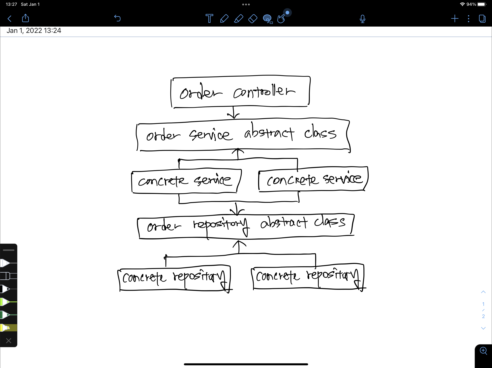
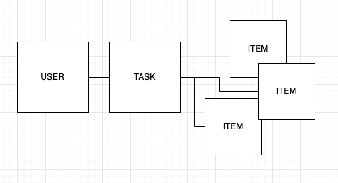

# DAY 1 - 2022-01-01

---

# 할 일

- 펼치기
    - project structure 파악하기
    - 요구사항 확인하기
    - 요구사항과 프로젝트 구조파악을 통한 나만의 과제 spec 설정
    - 설계(domain modeling, use case description)

---

# Project Structure 파악하기

- 펼치기
    - 전체적으로는, `DAO`(`Data Access Object`) 로 Database 에 접근하고 있다.
    - `Exceptions` 라는 directory 에 custom exception 을 만들어내고 있다.
        - 궁금한 점: 서비스가 고도화되고, 규격화 해야 할 예외가 많아진다면 `exception` 도 계속해서 늘어날텐데, 이 문제는 어떻게 할 수 있을까? 좀 더 구체화 해야 할 필요가 있는, 현재로서는 피상적인 생각이지만 design pattern 을 적용해서 좀 더 유연하게 풀어낼 수 있을 거 같다는 생각이 든다.
    - `middlewares` 라는 directory 에서는 authentication 과 exception 처리를 담당하고 있다.
    - 각각의 domain 들은 `component` 라는 controller layer, `service` 라는 service layer, 그리고 `dao` 라는 repository 에 해당하는 layer, 그러니까 3 tier layer 를 기본적으로 따르고 있다.
        - 궁금한 점: 그런데 테이블이 존재하지 않는 경우의 오류까지도 고려하여 DAO 에서 table creation 까지도 하고 있다. `Data Access Object` 라는 것의 책임은 어디까지인지 고민해 보고 refactor 할 수 있는 여지가 있는지 생각해보자.
        - 궁금한 점2: database 는 `policy` 가 아니라 `detail` 이다. sqlite 같은 in-memory 가 아니라 `mysql` 이 될 수도 있고, mongo 나 dynamo 같은게 될 수도 있고, casandra 같은 database 가 될 수도 있다. DAO 와 database 를 분리해야한다는 생각이 든다.
    - `config` 같은 경우는, 현재 plain text 로 노출이 되어있다. `.env` 를 통해 environment variable 을 숨겨야 할 필요가 있다고 생각한다.
        - `dotenv` 를 통해 작업 완료

---

# 요구사항 확인하기

- 펼치기
    - 각 컴포넌트들을 구조화 하라
    - OOP based 프로그래밍을 할 수 있어야 한다
    - 확장성이 고려된 프로젝트를 완성할 수 있어야한다.
    - 그 외에는
        - 개발요소들의 재사용성을 확보해야 한다
        - 데이터베이스 구조화가 필요하다
    
    라는 요구사항이 있었다. 
    

---

# 나만의 과제 설정

- 펼치기
    
    ## Typescript 사용
    
    javascript 는 기본적으로 prototype based language 라서 우리에게 익숙한 그 OOP 랑은 약간 다르다. 또한, type-safe 하지 않다. (그렇다고 해서 typescript 가 compiled language 만큼 type-safe 하단 것은 절대 아니지만, 그럼에도 불구하고 개발하는 환경에서 type-safe 하게 개발할 수 있다는 점은 큰 장점이라고 생각한다) 
    
    나는 위에 적은 이유들로 인해, OOP 스러운 설계를 좀 더 편리하게 하기 위해서 `Typescript` 를 사용하기로 생각했다.
    
    ### tsconfig.json setup
    ```json
    {
    	"strict": true,                                   
    	"noImplicitAny": true,                        
    	"strictNullChecks": true
    }
    ```
    
    `strict` mode 를 켜고, typescript 를 사용하는 만큼 `any` 를 최대한 지양하기 위해 `noImplicitAny` 도 켰으며, null check 를 typescript 가 해 주게 만들어 실수를 줄이기 위해 `strictNullChecks` 또한 켰다. 
    
    ### update dependencies with @types
    
    나머지 것들도 typescript 와 호환되게끔 설정을 시켜주었다. 
    
    ## DAO 의 책임 파악 및 DAO 수정
    
    DAO 는 database 에 접근하여(`access`) 값을 가져오는 object 를 의미한다. 그러나, washswat 의 repository 에서 각각 domain 의 DAO 는 exception 을 처리할 때 database 생성 등의 query command 또한 보내고 있다. DAO 의 책임이 어디까지가 적절할 지 등을 파악하자. 
    
    ## architecture
    
    확장성을 중요시하게 여긴다고 하였으니, typescript 의 `interface` 나 `abstract class` 를 통해 의존관계를 느슨하게 만들어주어야겠단 생각을 했다. concrete 한 것에 의존하는 건, 그만큼 concrete 한 게 바뀌는 순간 바뀌어야 할 일이 많아져야 한다는 상황을 의미하니, 확장성이나 유지보수/변경 이 일어나는 상황에서 투입되어야 할 공수(manpower)가 높은 확률로 늘어날 것이다. 
    
    ### interface vs abstract class
    
    여기서 고민이 되는 건 `interface` 를 사용하느냐, 아니면 `abstract class` 를 사용하느냐인데, 나는 `interface` 대신 `abstract class` 를 사용하고자 한다. 이유는, typescript 에서 javascript 로 transpile 되면서 interface 는 완전히 사라져 버리는 반면, abstract class 는 `class extends` 형태로 남아있기라도 하기 때문이다. 결국엔 javascript file 이 돌아가는 것이니만큼, javascript 의 spec 을 최대한 살릴 수 있도록 해야겠다는 생각이 들었다.
    
    ## 환경변수 은닉 with dotenv
    
    plain text 형태로 환경변수가 노출되는 건 좋지 않다. 그래서 일단은 `.env` 파일을 이용하는 식으로 환경변수를 은닉했는데, 나중에 `aws systems manager` 등으로 변경되는 사항에도 어느정도 대비를 하면 좋을 거 같긴 하다. 물론 이는 후순위. 
    
    ## package.json 의 node version 설정
    
    ```json
    {
    	"engines": { 
    		"node": ">=14.0.0"
    	}
    }
    ```
    
    node 버전이 14 이상이어야 한다고 해서, 14 버전으로 `package.json` 에 property 를 추가해주었다. `.npmrc` 를 만들어서 14버전 이상이어야만 한다고 강제를 할까 했는데, 강제하지는 않았다. 
    
    또한, 현재 LTS 버전이 16버전이고 나도 16 버전으로 작업중이지만, 혹시 모를 호환성을 위해 `nvm` 을 통해 node 의 14 버전 중 가장 최신 버전인 `14.18.2` 로 `nvm install 14.18.2` & `nvm use 14.18.2` 를 통해 14 버전 중 가장 최신 node 버전으로 내 환경도 설정한 후 작업을 진행하기로 했다. 
    

---

# 설계

## Component Level

- 펼치기
    
    
    
    설계 자체는 이런 식으로 했다. 일단 `3 tier layer architecture` 로 기존 code base 를 만들어놓았으니 마찬가지로 component 구성도 마찬가지로 이렇게 3 tier layer 로 큰 틀을 잡았다.
    
    확장성 (예를 들면 service layer 에선 일반 고객을 위한 서비스와 우수 고객을 위한 서비스 등이 생길 경우, repository layer 에서는 데이터베이스가 `sqlite` 이 아니라 `mysql` 이나 `mongo`, `dynamo` 등으로 변경될 수 있는 경우를 상정) 을 위해 `abstract class` 로 최대한 느슨하게 연결고리를 만들어주었다. 
    
    사실 개발 초창기라면 일단 business logic 을 빠르게 구현하고, 만약 interface / abstract class 로 공통부분을 묶어 추상화 할 수 있는 여지가 생긴다면 그 때 하는 것이 좋기에 바로 concrete class 를 만들어나가면서 작업을 하는 게 좀 더 software lifecycle 을 고려한 strategy 로서 적합하다고 생각한다. 
    
    그러나, 지금은 spec 이 정해져 있는 과제이기 때문에 먼저 이렇게 추상화를 하고 시작할 수 있었다. 그림 자체는 `order` domain 에 대해서 그렸으나, 나머지 domain 도 전체적인 틀은 마찬가지로 이렇게 구성할 생각이다.
    

## Domain Level

- 펼치기
    
    
    
    주요 개념과 개념간의 관계를 소프트웨어의 사용자의 관점에서 나타내보았다. 사용자는 세탁을 맡기는 주문을 넣을 것이고, 그 주문 안엔 하나 이상의 세탁물들이 포함되어 있을 것이다. 
    
    위처럼 글로 풀어서도 정리해봤고, 좀 더 시각적으로 명확하게 인지하기 위해서 저렇게 도식을 그려보기도 하였다. 복잡할 필요가 없고, 복잡해서도 안 된다. 사용자가 생각하는 방식과 최대한 유사하게, 간단하게, 추상적으로 생각해야 한다. 왜냐면, 이 domain 구조는 크게 바뀌지 않을 것이기 때문이며, 바뀌기 힘들어야 하기 때문이다. 
    

## UseCase Level

- 펼치기
    
    **시작하며**
    
    - 펼치기
        
        세상엔 참 다양한 손님들이 많을 것이다. 그만큼 요구사항도 다양할 것이며, 그렇기에 다양한 use case 가 존재할 수 있다. 그러나, 일단은 구현을 요청한 REST API 에 나와있는 상황들을 기반으로 use cases 들을 작성해보자. 
        
    
    **Use Case List**
    
    - 펼치기
        
        **유즈케이스명: 세탁 주문 등록**
        
        일차 액터: 고객
        
        주요 성공 시나리오:
        
        1. 고객이 주문을 할 의류를 등록한다.
        2. 고객이 주문의 종류를 선택한다.
        3. 고객이 주문에 대한 상세 설명을 한다.
        4. 고객이 주문을 할 의류에 대한 사진을 등록한다. 
        5. 시스템은 1~4까지의 입력값이 valid 한 지 확인한다. 
        6. 시스템은 주문의 접수 결과를 제공한다. 
        
        확장: 
        
        1a. 고객은 주문을 할 때 여러 개의 의류를 등록할 수 있다.
        
        4a. 고객은 주문을 할 의류에 대한 사진을 여러 장 등록할 수 있다. 
        
        **유즈케이스명: 세탁 주문 일괄 조회**
        
        일차 엑터: 고객
        
        주요 성공 시나리오:
        
        1. 고객이 본인이 접수하였던 세탁 주문 일괄 조회를 요청한다.
        2. 시스템은 고객을 파악할 수 있는 고유값을 통하여, 주문 목록으로부터 고객의 주문을 찾는다.
        3. 시스템은 찾아낸 고객의 주문들을 제공한다. 
        
        **유즈케이스명: 세탁 주문 특정 조회**
        
        일차 엑터: 고객
        
        주요 성공 시나리오:
        
        1. 고객이 본인이 접수하였던 주문 목록 중, 특정 주문에 대한 정보를 요청한다. 
        2. 시스템은 특정 주문을 파악할 수 있는 고유값을 통하여, 주문 목록으로부터 해당 주문을 찾는다.
        3. 시스템은 찾아낸 특정 주문을 제공한다.
        
        **유즈케이스명: 세탁 주문 삭제(취소)**
        
        일차 엑터: 고객
        
        주요 성공 시나리오:
        
        1. 고객이 본인이 접수하였던 주문 목록 중, 특정 주문에 대한 삭제(취소)를 요청한다.
        2. 시스템은 특정 주문을 파악할 수 있는 고유값을 통하여, 주문 목록으로부터 고객의 주문을 찾는다.
            1. 만약 고객의 주문을 찾았다면, 해당 주문을 삭제(취소) 처리 한다.
        3. 시스템은 고객의 삭제(취소) 요청에 대한 결과를 반환한다.

---

# DAY 2 - 2022-01-02 의 계획

- 펼치기
    - ‘세탁 주문 서비스’ 라는 시스템을 구성하는 객체들을 오늘 설계한 `domain model` 기반으로 설계하기
        - 설계의 핵심은 객체들의 자율, 그리고 책임
    - 객체들 간의 오가는 `message` 와 협력 관계 설정하기
    - `interface` (`abstract class`) 정리하기