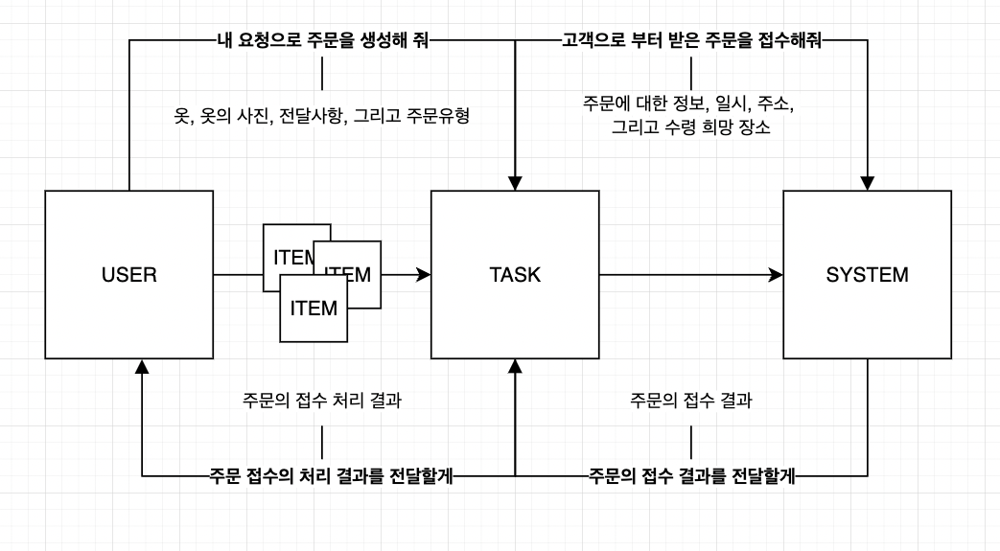
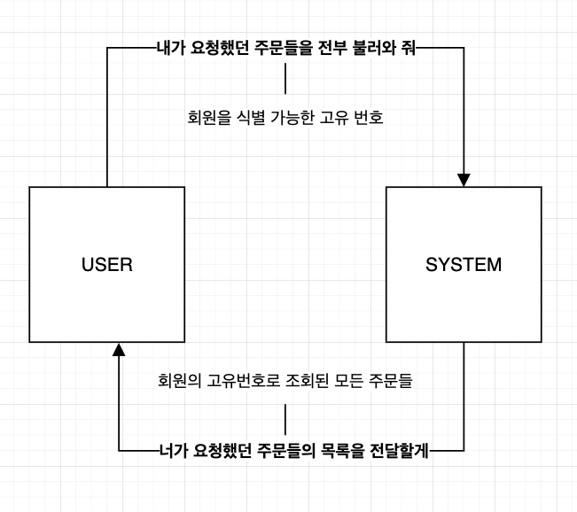
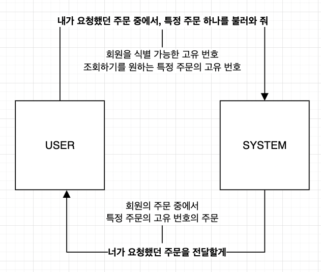
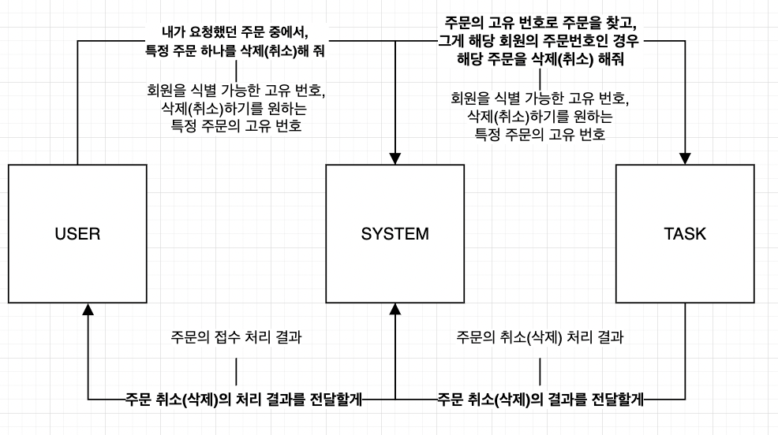
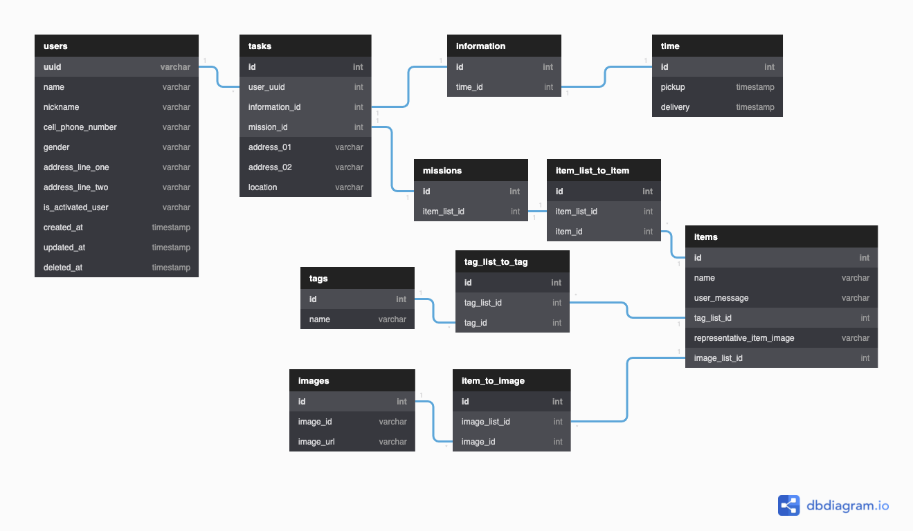

# DAY 2 - 2022-01-02

---

# 할 일

- 펼치기
    - ‘세탁 주문 서비스’ 라는 시스템을 구성하는 객체들을 오늘 설계한 `domain model` 기반으로 설계하기
        - 설계의 핵심은 객체들의 자율, 그리고 책임
        - 객체들 간의 오가는 `message` 와 협력 관계 설정하기
    - `interface` (`abstract class`) 정리하기
    - domain object + @ 구현하기
    - database schema 설계해보기
    - use case 별로 생길 수 있는 test case 들을 state transition diagram 을 통해서 정리해보기
        - edge case (fail)
        - happy route (success)
        - ignore case (none)

---

# Domain model 기반의 설계: 자율과 책임을 중점으로
    
## 시작하며

어제 그린 domain model 을 기반으로 어떤 객체들이 협력을 해야하는지를 생각해보았다. 

## 주문 생성



먼저 주문 생성이다. 주문 생성 use case 를 기반으로 메시지와 응답을 만들어보았다. 

## 주문 일괄 조회



그 다음으로는 주문 일괄 조회이다. 이 역시 use case 를 기반으로 작성해보았다. 

## 특정 주문 조회



이번엔 특정 주문 조회이다. 내 주문 중에서, 한 특정 주문만을 보기를 원하는 경우를 나타냈다. 

## 주문 취소(삭제)



마지막으로 주문 취소(삭제) 이다. 내 주문 중에서 한 특정 주문을 삭제하기를 원하는 경우를 나타냈다. 
    

---

# Domain Object + @ 구현
```tsx
import { Image } from './image';
    
export interface CreateItemDto {
    ...
}
    
export class Item {
  ...
    
  private findImageIndexByImageId(imageIdToFind: string) {
    return this.imageList.findIndex((image) => image.imageId === imageIdToFind);
  }
    
  public insertImagesToImageList(images: Image[]) {
    this.imageList.push(...images);
  }
    
  public deleteImageByImageId(imageIdToDelete: string) {
    delete this.imageList[this.findImageIndexByImageId(imageIdToDelete)];
  }
    
  public updateRepresentativeItemImageByImageId(imageIdoChoose: string) {
    const indexOfImageToChoose = this.findImageIndexByImageId(imageIdoChoose);
    this.representativeItemImage =
      this.imageList[indexOfImageToChoose].imageUrl;
  }
}
```
  
`critical business rule` 과 `critical business data` 를 통해 `domain object` 들을 구현하고 있다. 중간 즈음 기록용으로 코드를 올려보자면 대략 이런 식이다.

중요하게 생각하고 구현하는 부분은, domain object 의 자율성과 책임이다.

예를 들어, `item` 이라는 domain object 는 `userMessage` 나 `userName` 을 가질 수 있다. 누군가의 요청에 의해 해당 부분을 변경해달라는 message 를 수신하면, 이를 갱신해야 할 책임이 있고, 그 역할을 위한 method 를 구현하였다.

추가로, item 의 `imageList` 와 관련해서도 여러 책임이 있을 수 있다. 예를 들면 이미지를 올린다든지, 이미지를 삭제한다든지, 대표 이미지를 변경하다든지. 이는 `tagList` 도 마찬가지이다.

해당 데이터들의 형식은 `array of object` 구성으로 되어있기에, 해당하는 `imageId` 나 `tagName` 을 찾아는 method 를 만들었고, 외부에 굳이 노출시킬 필요 없는 method 이기에 encapsulizing 를 시키기 위해 `private` accessor 를 붙였다. 그리고, 그 method 를 통해서 이미지 추가, 이미지 삭제, 대표 이미지 변경, 태그의 추가, 태그의 삭제 등을 하는 method 들은 외부에서 사용이 가능하게 `public` accessor 를 붙여주었다.

이런 식으로 각 domain object 들의 자율성을 최대한 확보시키면서 구현을 해 나가고 있다. 자율성에 집중하는 이유는 유연한 구조를 위해서이다. 가령, detail 에 가까운 database type 등이 변경되었을 때, 특정 type 의 database 와 domain object 가 거의 비슷할 정도로 의존성을 가지면, migration 등의 상황에 투입되는 공수가 매우 많아질 것이다.

## 구현하면서 아쉬웠던 점

일단은 별도의 `feature/domain-object` branch 를 만들고 작업했어야 했고, rollback 을 할 상황을 대비해 commit 을 작은 단위로 여러 번 했어야 했는데, 설계와 구현에 정신이 팔려 이 두 개를 하지 못 한게 아쉬웠다.

내일부터는 하면 되지 뭐.
    

---

# Database Schema 설계


domain model 들과 그 model 들을 기반으로 만들어진 값들을 어떻게 담으면 좋을까 고민하면서 `database schema` 의 초안을 작성해보았다. 

뭔가 군더더기가 많은 거 같기도 하고, 괜스럽게 복잡한 것들이 있는 거 같은 피상적인 느낌이 드는데 더 이상 집중이 잘 되지 않아서 오늘은 일단은 여기서 마무리하려고 한다. 
    

---

# DAY 3 - 2022-01-03 의 계획
- database schema 설계 검수하기
    - database table 만들기
    - `sqlite3` 와 `better-sqlite3` setup 하기
    - database table 과 server application connection testing 해 보기
- domain model method 부분 점검 - encapsulization, accessor 위주로 보기
    - 추가로, 가독성까지도 고민해보기.
        - OOP 의 boilerplate code 라는 이유만으로, getter, setter 를 전부 구현해 놓는 건 합리적일까?
- 무엇을 작업할 지 정하고, 작업별로 task card 를 만든다는 느낌으로 작업하기
    - feature branch 를 따고, merge & pull request 를 하는 방식으로 진행한다.
    - rollback 상황을 고려하여, commit 의 단위는 짧게 한다.
- use case 별로 생길 수 있는 test case 들을 state transition diagram 을 통해서 정리해보기
    - edge case (fail)
    - happy route (success)
    - ignore case (none)
- service, repository layer 에 대한 abstract class / interface 설계 / 구현하기
- state transition diagram 을 기반으로 service logic 들에 대한 test code 작성하기
- abstract class / interface 를 기반으로 concrete service logic 구현하기
- dependency injection 방식으로 database 와 connection testing