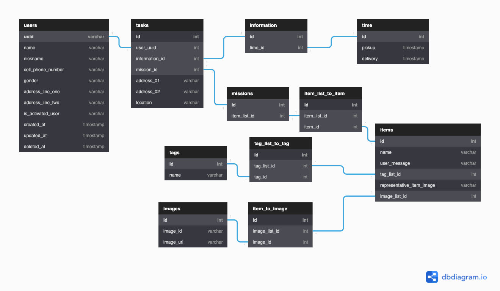
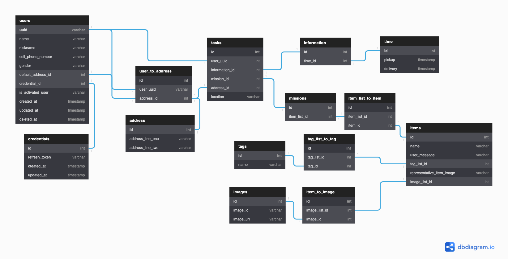

# DAY 3 - 2022-01-03

---

# 할 일
- 무엇을 작업할 지 정하고, 작업별로 task card 를 만든다는 느낌으로 작업하기
    - feature branch 를 따고, merge & pull request 를 하는 방식으로 진행한다.
    - rollback 상황을 고려하여, commit 의 단위는 짧게 한다.
- database
    - schema 설계 검수하기
    - database table 만들기
    - `sqlite3` 와 `better-sqlite3` setup 하기
    - database table 과 server application connection testing 해 보기
- domain model method 부분 점검 - encapsulization, accessor 위주로 보기
    - 추가로, 가독성까지도 고민해보기.
        - OOP 의 boilerplate code 라는 이유만으로, getter, setter 를 전부 구현해 놓는 건 합리적일까?
- use case 별로 생길 수 있는 test case 들을 state transition diagram 을 통해서 정리해보기
    - edge case (fail)
    - happy route (success)
    - ignore case (none)
- service, repository layer 에 대한 abstract class / interface 설계 / 구현하기
- state transition diagram 을 기반으로 service logic 들에 대한 test code 작성하기
- abstract class / interface 를 기반으로 concrete service logic 구현하기
- dependency injection 방식으로 database 와 connection testing

---

# Database
    
## Schema 설계 검수하기

- 펼치기
    
    ## 시작하며
    
    
    
    어제 작성한 schema 구조를 다시 한 번 점검한다음, 본격적으로 database configuration 을 시작해보고자 한다.
    
    ## Self Feedback
    
    > SQLite is a C-language library that implements a [small](https://www.sqlite.org/footprint.html), [fast](https://www.sqlite.org/fasterthanfs.html), [self-contained](https://www.sqlite.org/selfcontained.html), [high-reliability](https://www.sqlite.org/hirely.html), [full-featured](https://www.sqlite.org/fullsql.html), SQL database engine. - SQLite
    > 
    
    SQLite 또한 결국 RDBMS 의 일종이므로, ‘충분한 정규화(normalization)가 이루어 졌는가?’ 에 대해서 스스로 질문을 많이 던졌다. 
    
    ## About Normalization
    
    ### **1NF**
    
    일단은 primary key 를 각각 두었고, composite key 로 사용할 수 있는 요소들도 최대한 충분히 확보하였다. 예를 들자면, `users` 의 경우엔 name 이 같아도 `nickname` 이 다를 수 있고, 그게 달라도 `cell_phone_number` 가 달라 모든 column 이 unique 할 수 있는 그런 상황이다. 
    
    ### **2NF**
    
    foreign key 를 놓는 형식으로 relation mapping 을 최대한 해 주었다. 가령, `tags` 도 하나의 string 으로 들고 있다가(`’세탁’, ‘얼룩’`) `split` 등을 통한 business logic 으로 array 를 변환시키는 게 아니고, `items.tag_list_id` 와 `tags`, 그리고 그 둘의 join table 인 `tag_list_to_tag` 로 분리를 시켜주었다. 이렇게 relation mapping 을 최대한 해 놓으면, 나중에 서비스의 규모가 커지는 상황에서 `tag` 를 기준으로 무언가 작업을 할 때 하나의 string 으로 들고 있는 것보다 더 적은 비용으로 작업을 할 수 있는 여지를 남길 수 있다. 
    
    ### **3NF**
    
    candidate key 들의 subset 에 대한 `transitive functional relation` 제거는 사실 서비스 운영 정책에 따라 달라질 수 있는 부분이지만, 일단은 최대한 normalization 을 진행해보자는 생각을 하여 최대한 normalization 을 진행하였다. 
    
    특히, `transitional functional relation` 이 발생할 수 있는 부분들을 중점적으로 봤는데, 대표적인 요소가 바로 주소와 장소에 대한 정보 또한 담기는`tasks` 이다. schema 와 상황을 검토하면서, 이들은 서로간의 `transitional functional relation` 을 가질 수도 있다고 판단하였다. 
    
    예를 들면 `addres_01` 이 `남양주시 별내0로 000-000` 이고, `address_02` 가 `00아파트 0000-000`, location 이 `집앞` 이었는데 갑자기 그 날 그 때 집에 없어서 `address_01` 을 `서울 동대문구 이문로 107` 로 변경할 수 있다. `address_01`, 즉 도로명 주소가 변경되면 `address_02` 도 매우 높은 확률로 변경되어야 하니,(다른 지역에 같은 아파트가 있고, 같은 동호수가 있는 경우가 아니라면 말이다) 이 둘은 `transitional functional relation` 을 가진다고 볼 수 있다고 판단하였다.
    
    물론 시스템을 운용하는 입장에서 정책적으로 해결하는 방식으로 이를 해결할 수도, 혹은 business logic 으로 처리를 할 수도 있는 선택지 또한 존재한다. 정책적으로 풀어낸다면 ‘한 번 요청한 세탁물 수거 주문은 위치변경이 불가능합니다’ 등의 정책에 따라 schema 에 따르면 `transitional functional relation` 이 발생할 여지가 있지만, 발생할 일이 없게끔 할 수도 있다. business logic 으로 처리를 하게끔 하다면, `updateTask` 라는 method 의 dto 를 만들 때 `address_01, address_02, location` 를 모두 `required value` 로 요구하면 될 것이다. 
    
    ### 3.5NF AKA Boyce-Codd NF
    
    `boyce-codd nf`, 익히 3.5 normalization form 이라고 불리우는 정규화의 형태이다. 하나 이상의 `candidate key` 를 가지고 있느냐가 관건인데, `primary key` 또한 `candidate key` 로 볼 수 있고, 모든 table 에 primary key 가 존재하므로, 3.5NF 의 조건을 만족한다. 
    
    ## Authorization
    
    token based authentication / authorization 을 이용하는 codebase 인걸 확인하여, `users` 와 별개로 `credentials` 라는 table 을 만들어주었다. 일단 기본적으로 분리한 이유는, 인증/인가 정보까지 들고있기엔 `users` table 이 너무 많은 책임을 지게 되게 하는 구조라고 생각이 들었기 때문이다.  
    
    여기에는 `refresh_token`, 그리고 created_at 과 updated_at 이 담긴다.  특히 `refresh_token` 은 application level 에서 보자면 사용자의 회원 가입 및 자동 로그인 주기와 관련이 있는데,  자동 로그인 기간이 만료가 되어 다시 로그인을 하거나, 혹은 어떤 이유로 로그아웃을 하여 `refresh_token` 을 다시 발급받는 상황을 `updated_at` 이라는 timestamp 를 통해 해당 사용자의 최근 로그인 날짜를 확인할 수도 있다. 
    
    ## 민감정보의 분리
    
    민감정보 등의 문제까지 고려한다면 table 이 아닌 database 자체를 분리하거나 infrastructure level 에서의 망 분리까지 고려해야 하지만, 현재로서는 On-Premis, 혹은 AWS infra 를 통한 배포 상황은 고려하지 않고, 민감정보 등의 문제를 고려해야하는 법적 기준 검토가 먼저 이뤄져야 하기 때문에 민감정보 문제는 넘어가기로 하였다.
    
    ## Refactored Table
    
    
    
    
    
    위가 초안, 아래가 고려사항을 반영하여 다시 만들어 본 수정안이다. 
    

## Databaes Table 만들기 

```tsx
export const createTableQuery = `
CREATE TABLE users (
  uuid varchar(255) PRIMARY KEY,
  name varchar(255),
  nickname varchar(255),
  cell_phone_number varchar(255),
  gender varchar(255),
  default_address_id int,
  credential_id int,
  is_activated_user varchar(255),
  created_at timestamp,
  updated_at timestamp,
  deleted_at timestamp
);

CREATE TABLE credentials (
  id int PRIMARY KEY,
  refresh_token varchar(255),
  created_at timestamp,
  updated_at timestamp,
  FOREIGN KEY (id) REFERENCES users (credential_id)
);

CREATE TABLE user_to_address (
  id int PRIMARY KEY,
  user_uuid varchar(255),
  address_id int,
  FOREIGN KEY (user_uuid) REFERENCES users (uuid),
  FOREIGN KEY (address_id) REFERENCES users (default_address_id),
  FOREIGN KEY (address_id) REFERENCES address (id),
  FOREIGN KEY (address_id) REFERENCES tasks (address_id)
);

CREATE TABLE address (
  id int PRIMARY KEY,
  address_line_one varchar(255),
  address_line_two varchar(255)
);

CREATE TABLE tasks (
  id int PRIMARY KEY,
  user_uuid int,
  information_id int,
  mission_id int,
  address_id int,
  location varchar(255),
  FOREIGN KEY (user_uuid) REFERENCES users (uuid)
);

CREATE TABLE information (
  id int PRIMARY KEY,
  time_id int,
  FOREIGN KEY (id) REFERENCES tasks (information_id)
);

CREATE TABLE time (
  id int PRIMARY KEY,
  pickup timestamp,
  delivery timestamp,
  FOREIGN KEY (id) REFERENCES information (time_id)
);

CREATE TABLE missions (
  id int PRIMARY KEY,
  item_list_id int,
  FOREIGN KEY (id) REFERENCES tasks (mission_id)
);

CREATE TABLE item_list_to_item (
  id int PRIMARY KEY,
  item_list_id int,
  item_id int,
  FOREIGN KEY (item_list_id) REFERENCES missions (item_list_id),
  FOREIGN KEY (item_id) REFERENCES items (id)
);

CREATE TABLE items (
  id int PRIMARY KEY,
  name varchar(255),
  user_message varchar(255),
  tag_list_id int,
  representative_item_image varchar(255),
  image_list_id int
);

CREATE TABLE tag_list_to_tag (
  id int PRIMARY KEY,
  tag_list_id int,
  tag_id int,
  FOREIGN KEY (tag_list_id) REFERENCES items (tag_list_id),
  FOREIGN KEY (tag_id) REFERENCES tags (id)
);

CREATE TABLE tags (
  id int PRIMARY KEY,
  name varchar(255)
);

CREATE TABLE item_to_image (
  id int PRIMARY KEY,
  image_list_id int,
  image_id int,
  FOREIGN KEY (image_list_id) REFERENCES items (image_list_id),
  FOREIGN KEY (image_id) REFERENCES images (id)
);

CREATE TABLE images (
  id int PRIMARY KEY,
  image_id varchar(255),
  image_url varchar(255)
);`;
```
        
    
위의 table 을 만들어주는 query string 을 `string` type 으로 만들어놓았다. sqlite 은 처음이라 시간이 좀 걸렸고, `TypeORM` 을 써 보려 했으나 codebase 에 raw query 가 있는 걸 보아 뭔가 “database query handling 을 할 수 있는 역량도 보려는 건가?” 라는 생각에 ORM 은 사용하지 않았다. 오늘 가장 시간이 많이 든 부분은 이 부분이었다. 
    
---

## SQLite3 & Better-SQLite Setup
```tsx
class NewDatabase {
    // @ts-ignore
    private static database;
    private constructor() {}
    private static getDatabase() {
    if (!this.database) {
      this.database = new Database('washswot');
      this.database.exec(createTablesQueries);
    }
    return this.database;
    }
}
```

이제 code level 에 database 를 연동하는 절차를 거쳐야 한다. 일단 위에 적은 sqlite3 query string 으로 table 이 잘 생성되는 것은 확인하였고, 이제 database object 를 어떤 식으로 관리할 것이며, 어떤 식으로 setup 할 것인가를 고려해보았다. 

결론을 내리자면, 위의 `NewDatabaes` 코드에서 보이듯이 `singleton` 방식으로 database object 를 제어하고 있다. 이유는 `thread-safe` 를 위해서이다. 전역적으로 database object 는 단 하나여야 좀 더 오류를 줄일 수 있다고 생각하였다. `washswot` 이란 이름의 `sqlite` database 를 만들고, 위의 query string 을 통해 table 을 만든 뒤, singleton instance 로 관리되는 `static` method 로 만들어진 database 를 호출하자는 목적으로 해당 코드를 작성하였다. 
    
---

## Database 와 server application connection testing
    
일단은 typescript 로 작성하고 있는 현재의 codebase 에서는 모든 걸 다 typescript 에 맞추어 바꾸어야 하기에 바로 testing 을 할 수 없었고, 원본 repository javascript code 에서 testing 을 시도했고, 성공했다. 
        

---

# 2022-01-03 작업 후기

- 일단은 위에 적은 것처럼 feature 등의 상황 별로 branch 를 별도로 생성하고, commit 을 짧은 주기로 하는 (한 번에 많은 변경이 없게끔 자주자주 commit) 건 계속해서 떠올린 덕분에 잘 해냈다.
- `SQLite` 이라는 database 를 raw 하게 만져보는 건 ORM 을 통해 in-memory testing code 를 작성하는 것 이후로는 처음이고, `MySQL` 도 최근엔 거의 ORM 을 통해 작업하였기에 setup 과 configuration 에 시간이 좀 많이 걸렸다.
- 그래서, 내일의 계획을 약간은 바꾸어야 할 거 같다. 원래대로라면 domain object 들을 다시 한 번 점검하는 것이었지만, 일단은 ‘구동’ 이 되는 web application 을 먼저 만들어 보자는 걸 우선순위로 두었다. 이유는 오늘 database 쪽에 시간을 많이 쏟아서이다. ‘돌아가는 코드가 가장 좋은 코드이다’  라는 격언처럼 우아하고 좋은 코드 이전에 돌아가는 코드를 먼저 만든 뒤 그걸 개선하는 식으로 작업 계획을 짜는 것이 더 합리적이라고 생각한다. authentication / authorization, business logic with raw query 등 해야 할 게 많이 남았다.

---

# DAY 4 - 2022-01-04 의 계획

- 기본적인 configuration 마무리
    - 일단은 `npm start` 로 실행했을 때 구동이 되는 application 으로 configuration 완료하자
- use case 별로 생길 수 있는 test case 들을 state transition diagram 을 통해서 정리해보기
    - edge case (fail)
    - happy route (success)
    - ignore case (none)
- service, repository layer 에 대한 abstract class / interface 설계 / 구현하기
- state transition diagram 을 기반으로 service logic 들에 대한 test code 작성하기
- port and adaptor pattern 을 이용하여 domain object 와 database 연결하기
- abstract class / interface 를 기반으로 concrete service logic 구현하기
- dependency injection 방식으로 database 와 connection testing
- domain model method 부분 점검 - encapsulization, accessor 위주로 보기
    - 추가로, 가독성까지도 고민해보기.
        - OOP 의 boilerplate code 라는 이유만으로, getter, setter 를 전부 구현해 놓는 건 합리적일까?