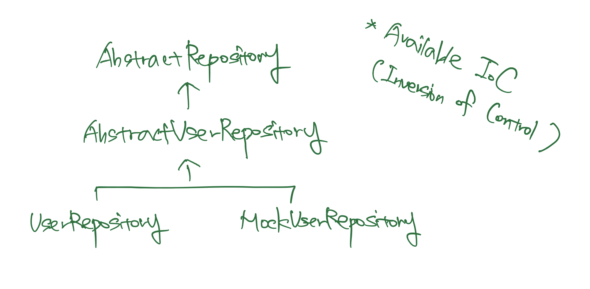
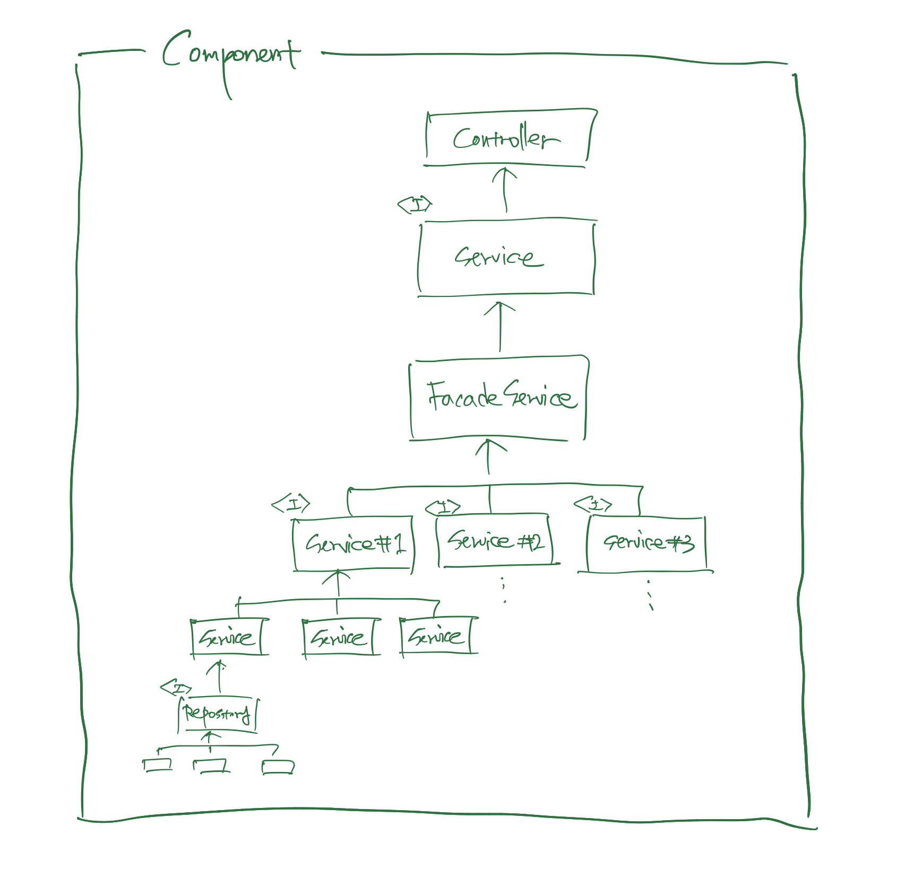

# DAY 5 - 2022-01-05

# 할 일
- configuration 완료 → controller ~ repository 까지 쭉 뻗는 business logic 작성
    - test 는 원래 test driven 으로 시작하려 했으나, 일정상의 이유로 test code 작성으로 변경
- use case 별로 생길 수 있는 test case 들을 state transition diagram 을 통해서 정리해보기
    - edge case (fail)
    - happy route (success)
    - ignore case (none)
- service, repository layer 에 대한 abstract class / interface 설계 / 구현하기
- state transition diagram 을 기반으로 service logic 들에 대한 test code 작성하기
- port and adaptor pattern 을 이용하여 domain object 와 database 연결하기
- abstract class / interface 를 기반으로 concrete service logic 구현하기
- dependency injection 방식으로 database 와 connection testing
- domain model method 부분 점검 - encapsulization, accessor 위주로 보기
    - 추가로, 가독성까지도 고민해보기.
        - OOP 의 boilerplate code 라는 이유만으로, getter, setter 를 전부 구현해 놓는 건 합리적일까?
            

---

# 기본적인 configuration 마무리

## TypeORM 으로 Database Entity 관리 전환

```tsx
// typeorm-connection.ts
export class TypeOrmConnection {
  private static connection: Connection;
  private constructor() {}
  public static async getConnection() {
    if (!this.connection) {
      this.connection = await createConnection({
        type: 'better-sqlite3',
        database: getConfig().databaseName,
        entities: [
          User,
          Credential,
          Address,
          Task,
          Information,
          Time,
          Mission,
          Item,
          Tag,
          Image,
        ],
        synchronize: true,
      });
    }
    return this.connection;
  }
}
```

## Domain Object to TypeORM Entity

```tsx
// structure of database directory
├── entities
│   ├── address.ts
│   ├── credential.ts
│   ├── image.ts
│   ├── information.ts
│   ├── item.ts
│   ├── mission.ts
│   ├── tag.ts
│   ├── task.ts
│   ├── time.ts
│   └── user.ts
└── typeorm-connection.ts
```

아무래도 domain object + raw query 를 통해서는 일정안에 작업을 끝낼 수 없을 거라 생각하여, `typeorm` 을 사용해 database repository 를 관리하기로 하였다. 비록 일정이 모자라면 일정을 더 요구해도 된다고 하였으나, 일단은 기간 안에 최대한 완성된 작업물을 만들어보는 게 엔지니어로서 더 맞다고 생각한다. 

`better-sqlite3` 과 `sqlite` 을 통해 setup 하라는 조건을 주었기 때문에, connection type 을 `better-sqlite3` 으로 설정하였다. 이렇게 해서 DB 와 관련된 공수를 줄인 만큼, business logic 과 authentication / authorization 을 구현해내고, 완성도를 높이는데 집중하도록 하자.

## enforce node version

```json
{
  "type": "commonjs",
  "name": "nodejs-test-inseob-jeon",
  "version": "0.0.0",
  "main": "./dist/server.js",
  "private": true,
  "engines": {
    "node": ">=14.0.0 <15"
  },
} 
```

14버전을 넘어가면 `sqlite3` 와 `better-sqlite3` 에서 충돌이 일어나, 원래는 `>=14.0.0` 만 추가했다가 `<15` 도 추가해주었다. 

## Mapping the relation of each entity

`TypeORM` 의 relation 을 통해 entity 들 간의 relation 을 제어하기로 했다.
    

---

# Abstraction, Testing, Mocking
    
## Abstraction



testing 이 용이하기 위해서는 modulizing 이 잘 되어야하고, modulizing 이 잘 되기 위해선 abstraction 이 필요핟하다. modulizing 이 되면 mocking 을 좀 더 쉽게 할 수 있고, mock 을 집어넣어서 test 를 하기 용이해진다. 위와 같은 이유로, 전체적으로 추상화를 진행하였다. 

### Abstract Strategy

- 추상적인 어떤 `repository` 가 있다.
- 위를 상속하여 만든, 추상적인 어떤 domain 에 대한 `repository` 가 있다.
    - 위를 상속하여 만든, 구체적인 어떤 domain 에 대한 `repository` 가 있다.
    - 위를 상속하여 만든, business logic testing 에 이용할 어떤 domain 에 대한 repository 가 있다.

component, controller, service 에 대해서도 이와 유사하게 추상화를 진행하였다. 

## Structure of a component



위의 추상화 전략을 하나의 집합체인 component 의 각각의 일부인 controller, service, repository 에 적용한 구조이다. 특이사항이 있다면 중간의 service 들이 `facade` service 라는 service class 에 호출되고 있다는 점이다. 

### Why I used facade pattern?

facade pattern 을 사용한 이유는 SOLID 하도록 codebase 를 작성하기 위해서이다. 그 중에서도 S, `single responsibility` 를 만족하기 위해서 facade pattern 을 사용한 게 크다. 

사용자라는 service 를 구성할 때, 사용자의 생성 및 조회, 삭제 등 뿐만 아니라, 사용자의 인증과 인가 등도 필요하며, 정규화를 통해 진행한 사용자에 one-to-many 관계로 종속되는 entity 인 주소지(`address`) 에 대한 관리도 필요하다. 

그러나 이는 사용자 service logic 이 해야 할 책임은 없다. 다시 말 해서, 사용자 service logic 이 바뀌어야 할 이유는, 사용자에 대한 정책이 바뀌어 이를 codebase 에 적용해야 할 때 뿐이지, 인증/인가 등의 정책이 바뀌었을 때 바뀔 필요는 없어야 한다는 이야기이다. 어떤 class 가 바뀌어야 할 이유를 각각 하나씩만 가지게끔 class 들을 책임과 역할에 따라서 나누었고, 이 다양한 class 들을 의존성 주입(`dependency injection pattern`)을 사용하여 `facade.user.service.ts` 라는 service class 에서 한 번에 관리하게끔 처리하였다. 

## Testing, Mocking

```tsx
// address.service.spec.ts
describe('Address service test', () => {
  const addressService = new AddressService(new MockAddressRepository());
  it('address entity object 를 잘 생성합니다.', () => {
    const address = addressService.createAddress({
      addressLineOne: '테스트 주소 1',
      addressLineTwo: '테스트 주소 2',
    });
    expect(address.addressLineOne).toBe('테스트 주소 1');
  });
});
```

`address` 라는 domain 의 service logic 을 test 하기 위한 test code 이다. 위에서 진행한 추상화 덕분에 진짜 repository 가 아니라, `MockAddressRepository` 를 주입하여 테스트를 진행할 수 있게 되었다. 

DB I/O 의 결과에 기반한 service logic testing 이 아닌, mocking test 를 한 이유는 test 의 `solitary` 를 위해서이다. service logic testing 은 service logic 에 대해서만 test 를 한다. 주입된 repository 가 정상적으로 작동한다는 가정 하에, service logic testing 만 진행하기 위해서이다. 

## 기타 등등

### conditional route / switch case statement → polymorphism

```tsx
public createAccessToken(createAccessTokenDto: CreateAccessTokenDto): string {
    try {
      if (createAccessTokenDto.tokenType !== 'access') {
        throw new Error('error: use valid token type');
      }
      const token = new AccessToken(createAccessTokenDto);
      return token.createToken();
    } catch (e) {
      throw e;
    }
  }

  public createRefreshToken(
    createRefreshTokenDto: CreateRefreshTokenDto,
  ): string {
    try {
      if (createRefreshTokenDto.tokenType !== 'refresh') {
        throw new Error('error: use valid token type');
      }
      const token = new RefreshToken(createRefreshTokenDto);
      return token.createToken();
    } catch (e) {
      throw e;
    }
  }
```

큰 부분은 아니지만, switch case 나 routing 부분을 대체한 부분 중 하나가 있다. 분기(route)로 만들어지는 경우를 `polymorphism` 을 통해 해결한 것이다. access token 과 refresh token 을 만들 때 사용해보았다. 

```tsx
switch (tokenType) {
    case 'access':
      // run the business logic which create access token
    case 'refresh':
      // run the business logic which create refresh token
    default:
      // describe the exception case
 }
```

원래대로라면 이런 분기를 통해 각각의 business logic 을 실행해 주는 식으로 갔겠지만, 

```tsx
export abstract class AbstractToken {
  abstract createToken(): string;
}
```

이번엔 `AbstractToken` 이라는 공통 abstract class 를 만들고, token 을 만들어 반환하는 `createToken` 이라는 abstract method 를 정의한 다음

```tsx
export class AccessToken extends AbstractToken {
  constructor(private createTokenDto: CreateAccessTokenDto) {
    super();
  }

  public createToken(): string {
    return jwt.sign(this.createTokenDto, getConfig().jwtSecret, {
      algorithm: 'HS256',
      expiresIn: getConfig().accessTokenExpiresIn,
      audience: getConfig().jwtAudience,
      issuer: getConfig().jwtIssuer,
    });
  }
}
```

```tsx
export class RefreshToken extends AbstractToken {
  constructor(private createTokenDto: CreateRefreshTokenDto) {
    super();
  }

  public createToken(): string {
    const { uuid } = this.createTokenDto;
    return jwt.sign({ uuid }, getConfig().jwtSecret, {
      algorithm: 'HS256',
      expiresIn: getConfig().refreshTokenExpiresIn,
      audience: getConfig().jwtAudience,
      issuer: getConfig().jwtIssuer,
    });
  }
}
```

이러한 방식으로 각각 `AccessToken` 과 `RefreshToken` 을 만든 뒤, OOP 의 특징인 polymorphism을 통해 이렇게 코드를 작성해 보았다. 

조건이 많아질 때 `switch/case` 문이 비대해 져 생기는 human error 의 확률을 구조적으로서 줄일 수 있는 효용을 얻을 수 있다고 생각하여 판단하고 이런 식으로 교체를 시도해보았다. 
    

---

# Authentication / Authorization
 
## 시작하며

이제 사용자의 인증(`authentication`, 어떤 것의 validity 를 확인함)과 인가(`authorization`, 어떤 것이 기존에 validity 가 확인된 적이 있는지 여부를 확인함)과 관련된 시스템을 만들 시간이다. 

> 현재 프로젝트에서는 전화번호 인증 후 `Bearer token` 발급 후 고객의 `UUID`를 `request`에 저장하고 API 통신 시 활용하는 인증 체계가 세팅되어 있습니다.  - 세특 NodeJS 과제
> 

방향 자체는 이와 크게 다르지 않을 거 같다. 다만, 전화번호 인증(아마 문자 인증일텐데)과 관련된 service logic 은 휴대폰 인증 API 등을 구현할 수는 없는 노릇이기에 과제에서 구현할 수 있는 부분은 아니라고 생각하였고, 그러한 이유로 `authentication` 이 아닌 `authorization` 을 집중해보기로 결정했다.

---

## 전체적인 전략

## 기존 authorization 방식의 확인

```jsx
// middlewares/auth.js
import InvalidAuthorizedTokenError from '../exceptions/invalidAuthorizedTokenException';
import { verify, sign } from '../libs/jwt.js';
const bypassPathList = ['/login', '/'];
export const verifyJWT = (req, res, next) => {
  const bearerToken = req.headers['x-access-token'];
  try {
    if (bearerToken) {
      const token = bearerToken.replace(/^Bearer /, '');
      const user = verify(token);
      if (!user) {
        throw new Error();
      }
      req.user = user;
    } else {
      const { path } = req;
      const found = bypassPathList.find((p) => p === path);
      if (!found) {
        throw new Error();
      }
    }
    next();
  } catch (err) {
    next(
      new InvalidAuthorizedTokenError(err.message || 'Invalid Bearer Token'),
    );
  }
};
export const signing = (UUID) => sign({ UUID });
```

일단 `middleware/auth.js` 에서 authentication 을 담당하는 기존 코드는 

- `/login` 과 `/` endpoint 는 무시하고
- `header` 의 `x-access-token` 이라는 proeprty 에 Bearer token 을 담아
- 해당 property 로부터 bearer token 을 추출하고, verification 을 하고
- 그 verification 결과에 따라서
    - 인가받은 사용자가 맞다는 게 확인이 되었다면 Express 의 `Request` object 에 있는 `user` property 에 인증/인가 결과를 할당한다
    - 인가받은 사용자가 아니라는 게 확인이 되었다면, valid 하지 않은 token 으로 authorization 을 시도했다는 상황을 정의한 custom error 인 `InvalidAuthorizedTokenError` 를 throw 한다.

---

## 해당 방식을 기반으로 한 나의 authorization 방식

좋은 방법으로 authorization 처리를 해 주고 있어서 크게 수정할 것은 없는 것 같다. 다만 몇 가지는 수정하면 좀 더 나을 거 같다는 생각이 들었다. 

### No custom header

> Custom proprietary headers have historically been used with an `X-` prefix, but this convention was deprecated in June 2012 because of the inconveniences it caused when nonstandard fields became standard in [RFC 6648](https://datatracker.ietf.org/doc/html/rfc6648); others are listed in an [IANA registry](https://www.iana.org/assignments/message-headers/perm-headers.html), whose original content was defined in [RFC 4229](https://datatracker.ietf.org/doc/html/rfc4229). IANA also maintains a [registry of proposed new HTTP headers](https://www.iana.org/assignments/message-headers/prov-headers.html). - [MDN, HTTP Headers](https://developer.mozilla.org/en-US/docs/Web/HTTP/Headers)
> 

먼저 `X-` prefix 가 붙는 custom header 의 사용을 지양하기로 하였다. MDN 의 문서에도 나와있듯, custom header 를 사용할 땐 이런 convention 을 사용하였으나, 2012 년에 규격을 벗어나게 한다는 이유로 IANA 나 RFC 등에 의해 지양되고 있다.  그래서 [Authorization](https://developer.mozilla.org/en-US/docs/Web/HTTP/Headers/Authorization) 이라는 header 에 JWT 를 담아 보내기로 하였다. 

### Simplify the authorization process with passport

두 번째로는 인증/인가 라이브러리인 [passport](http://www.passportjs.org/packages/passport-jwt/) 사용이다. 그 중에서도 `jsonwebtoken` 을 사용하는 만큼, `passport-jwt` 를 사용하고자 한다. 그 이유는 코드베이스의 간략함 때문이다. authentication 과정에서 다양한 경우를 처리하지 않는다는 가정 하에, 별 다른 처리 없이 사용자의 authentication 만을 진행할 거라면 코드의 양을 일단은 줄여보자는 생각이 들었다. 코드가 적어질 수록, 버그도 적어지기에, 꼭 필요한 게 아니라면 신뢰도가 높은 라이브러리 등으로 코드를 줄이자는 주의이기에 passport 를 사용하기로 했다. 

---

## Token strategy and design for authorization

그 다음에는 authorization 에 사용할 token 에 대해서 전략을 세워보려고 한다. 

### **refresh token and access token**

먼저 token 을 access token 과 refresh token 두 개로 나누어 발급하기로 하였다. 그렇게 하기로 한 이유는 두 개이다. 사용자의 편의성과 보안. 

**Better user experience**

refresh token 은 access token 을 갱신할 수 있게 해주는, access token 에 비해 만료일이 조금 더 긴 token 을 의미한다. 이렇게 되면 access token 의 주기가 짧아져도, refresh token 으로 token 을 갱신하면 되기에 사용자가 계속해서 로그인 등을 처리할 필요가 없어진다. 

**Better security**

주기가 약간 긴 하나의 token 만으로 길게 하여 사용하는 방식 또한 좋은 방법은 아니라고 생각했다. 이유는 간단하다. 해당 token 이 유출되었을 때 주기가 길면, 그 token 으로 사용자인 척 위장할 수 있는 여지가 길어지기 때문이다.

### Token Design


그 다음에는 token 설계이다. 

**Algorithm**

먼저 암호화 알고리즘이다. github repository 의 코드에서 `HS256` 알고리즘을 이용하는 건 계속해서 이용하기로 했다. 왜냐하면, 나머지 알고리즘들도 있긴 하지만, 일단은 가장 무난하기도 하고, 더 좋은 알고리즘이 있지만, 해당 알고리즘은 client 와도 협력이 필요한 부분이 있기 때문이다. 

**Properties**

`audience` 와 `issuer` property 를 추가하였다. `audience` 는 누가 해당 token 을 사용하는지, `issuer` 는 누가 이 token 을 발급했는지에 대한 정보를 담는 property 이다. 

**ExpiresAt**

그 다음으로는 만료 주기이다. 일단은 access token 은 1일, refresh token 은 3일을 주었다. 이렇게 설정한 경우, 사용자는 만료된 refresh token 을 갱신하기 위해서 3일마다 재 로그인을 해야한다. 물론 이는 회사의 사용자 정책에 따라서 달라질 수 있는 부분이고, 나도 아직 경험이 부족한 탓에 어느정도의 주기가 사용자의 경험을 최대한 해치지 않는 선에서 사용자의 보안을 지켜낼 수 있는 지점인지는 잘 모르겠다. 그러나, 만료일은 가급적 짧으면 짧을수록 좋다는 생각에 일단은 이런 식으로 setup 을 하였다. 
    

 

---

# 2022-01-05 작업 후기
- 정신이 없다. 현실적으로 판단을 해서 전체적인 구조를 갈아엎었다.

---

# DAY 6 - 2022-01-06 의 계획
- implement authorization system
    - check again jwt design and strategy
    - using passport-jwt
- implement order component and it’s subcomponents
    - design the interface / abstract class
    - implement test code
    - implement concrete class based on the test code
- define custom error
- implement logging system