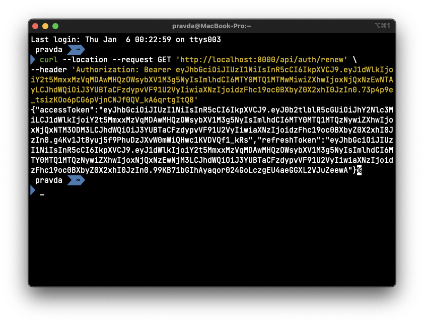
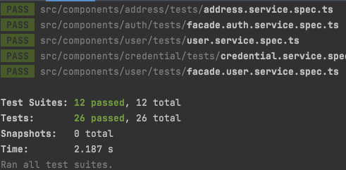

# DAY 6 - 2022-01-06

---

# 할 일
- implement authorization system
    - check again jwt design and strategy
    - using passport-jwt
- implement order component and it’s subcomponents
    - design the interface / abstract class
    - implement test code
    - implement concrete class based on the test code
- define custom error
- implement logging system

---

# Implement authorization system

    
## Check again JWT design and it’s strategy

### Check JWT design

```tsx
// .env
JWT_SECRET=washswot
JWT_AUDIENCE=washswot_user
JWT_ISSUER=washswot_labs
```

`issuer` 와 `audience` 를 넣은 구조 자체는 괜찮았으나, 각각의 값이 너무 유추하기가 쉬웠다. 그래서 특수문자를 넣어주고, 대소문자를 섞어주는 방식으로 조금 더 해당 값들을 유추하기 어렵게 만들어보았다. 

```tsx
// .env
JWT_SECRET=was!h_s@Wot
JWT_AUDIENCE=wa@Sh!sw*oT_uSer
JWT_ISSUER=w1as_hs@Wo&t_la#Bs
```

결국 `jwt debugger` 를 통해 확인해 볼 수 있는 값이지만, 그럼에도 혹시 모르는 상황을 방지할 수 있는 최선의 시도는 해 보고 있다. `bcrypt` 같은 module 로 hash 를 걸어버리는 방법도 있겠지만, 그것보단 전체적으로 돌아가는 시스템의 구성이 우선이라 생각하여 넘어가기로 했다. 

### Check JWT Strategy

전체적인 전략 점검이다. 우선 사용자가 처음 회원가입을 하거나 로그인을 해서 `authentication` 에 성공하면, respone 로 `{ accessToken: string, refreshToken: string }` type 을 반환하도록 test code 와 그에 상응하는 service logic 을 변경하였다. 

그렇게 발급받은 token pair 는 

- `accessToken`: 해당 accessToken 을 `Authorization` header 에 담아 보내 이전에 인증을 받았던 사용자인지를 판단하고, 인가를 내어준다.
- `refreshToken`:  웹/모바일 애플리케이션을 기준으로 `localStorage` 에 저장하는 식으로 처리하고, accessToken 이 만료되는 경우 localStorage 에서 refreshToken 을 불러와 갱신을 하는 식으로 처리하게끔 할 것이다

## Using passport-jwt

```tsx
npm install passport-jwt
npm install --save @types/passport-jwt
```

이제 `passport-jwt` 를 통해 기존 middleware 의 `auth.js` 를 좀 더 간단하게 만들어 보려고 한다. 

### Implement custom strategy

```tsx
const userServiceForValidation = new UserService(new UserRepository());
export const WashSwotStrategy = new Strategy(
  {
    secretOrKey: getConfig().jwtSecret,
    issuer: getConfig().jwtIssuer,
    audience: getConfig().jwtAudience,
    algorithms: [getConfig().jwtAlgorithm],
    jwtFromRequest: ExtractJwt.fromAuthHeaderAsBearerToken(),
  },
  async (jwtPayload: WashswotJwtInterface, done) => {
    try {
      const { uuid } = jwtPayload;
      const user = await userServiceForValidation.findUserByUUID({ uuid });
      if (user) {
        return done(null, { uuid } as AuthorizedUserInterface);
      }
      return done(new Error('invalid request'), false);
    } catch (e) {
      return done(new Error('invalid request'), false);
    }
  },
);
```

일단은 passport 의 인증절차를 구현하는 구현체인 `Strategy` 를 만들기 위해, user service class instance 를 user repository 를 통해 함께 만들었다. 

`Authorization` header로 부터 Bearer token 을 가져오고, 그 JWT 의 구성요소들에 대한 정보를 주면 그걸 기반으로 JWT 를 검증하고, JWT payload 안에 실어보내는 `uuid` 를 Express 의 `Request` object 안에 있는 `user` property 에 할당해주는 방식으로, 방식 자체는 기존 codebase 와 크게 다르지는 않다.

다만 기존 codebase 의 `auth.js` middleware 처리 방식 + `bypassPathList` 로 관리하는 게 괜찮아보여서 passport 도 별도로 빼고자 하였으나, 일단은 요구사항 구현부터 먼저 처리하기 위해서 각 router 의 endpoint 에 middleware 로 달아주는 방식을 사용하였다. 

```tsx
router.get(
  '/me',
  passport.authenticate(WashSwotStrategy, { session: false }),
  async (req, res) => {
    const { uuid } = req.user as AuthorizedUserInterface;
    const user = await this.userService.findUserByUUID({ uuid });
    res.send(user);
  },
);
```

로그인을 한 사용자가 자신의 정보를 볼 때 사용하는 `GET /api/user/me` endpoint 이다. middleware parameter 에 `passport.authenticate(strategyToUse, options?)` 과 같은 형식으로 passport 를 넘겨주면, 위에 사전에 정의했던 strategy 대로 JWT 를 검증하고, 검증 결과가 valid 하다면 `request.user` object 에 사용자 식별 정보를 할당해주는 방식으로 작동한다. 

## Implement service logic and +@ for update refreshToken

`accessToken` + `refreshToken` 을 통한 인증/인가 방식을 사용하고, refreshToken 은 `User` 라는 domain object 와 one to one 관계로 mapping 되어있는 `Credential` 이라는 곳에서 관리되고 있다. 

나중에 사용자의 accessToken 이 만료가 되었을 때, refreshToken 을 Authorization header 에 넣어서 인가를 거치고, 해당 refreshToken 이 valid 하다면 해당 사용자의 `Credential` 정보 중 `refreshToken` 을 갱신해 준 뒤, 새로운 accessToken 과 refreshToken 을 발급하는 상황을 위한 controller, service, 그리고 repository class 를 구현하였다. 

### Controller

```tsx
const path = '/auth';
router.get(
  '/renew',
  passport.authenticate(WashSwotStrategy, { session: false }),
  async (req: Request, res: Response, next: NextFunction) => {
    console.log(req.user);
    const { uuid } = req.user as AuthorizedUserInterface;
    const result = await this.facadeAuthService.updateCredentialByUUID({
      uuid,
    });
    res.send(result);
  },
);
```

우선 인증/인가와 관련된 일들의 책임은 `Auth` 라는 component 에 있다고 생각하여 auth component 에 credential service + repository 를 주입시켜서 구현해나가기로 하였다. `Authorization` header 에 refresh token 값을 담아 `GET /api/auth/renew` 요청을 보낼 시 facade pattern 으로 묶어준 service logic 이 실행되는 방식이다. 

### Service

```tsx
export class FacadeAuthService extends AbstractFacadeAuthService {
  constructor(
    private authService: AbstractAuthService,
    private credentialService: AbstractCredentialService,
  ) {
    super();
  }

  public async updateCredentialByUUID(
    updateCredentialDto: UpdateCredentialDto,
  ): Promise<AccessAndRefreshTokenInterface> {
    try {
      const { uuid } = updateCredentialDto;
      const tokenPair: AccessAndRefreshTokenInterface = {
        accessToken: this.authService.createAccessToken({
          tokenType: 'access',
          uuid,
        }),
        refreshToken: this.authService.createRefreshToken({
          tokenType: 'refresh',
          uuid,
        }),
      };
      const updated = await this.credentialService.updateCredentialByUUID({
        uuid,
        refreshToken: tokenPair.refreshToken,
      });
      if (updated) {
        return tokenPair;
      }
      throw new Error();
    } catch (e) {
      throw e;
    }
  }
}
```

auth service 가 생성될 때, `Credential` entity 에 대한 database i/o 까지 담당하는 `CredentialRepository` 를 포함한 `CredentialService` 를 주입하는 것은 auth service 에 너무 많은 책임을 지우는 것 같다는 생각이 들어서 이전과 마찬가지로 facade pattern 으로 별도의 `facade.auth.service.ts` 라는 service class 를 만든 뒤, 그 안에 `authService` 와 `credentialService` 를 주입시켜 service logic 을 구성하였다. 

### Repository

`facade.auth.service.ts` 에 주입된 `credentialService` 가 `Credential` 과 관련된 값들의 DB I/O 를 담당하는 `CredentialRepository` 와 같이 작동하고 있다. 

### Component

```tsx
export class AuthComponent extends AbstractComponent {
  constructor(private authController: AbstractAuthController) {
    super();
  }
  getController(): AbstractController {
    return this.authController;
  }
}
```

이제 해당 controller 를 반환하는 `AuthComponent` 를 만들었다.

```tsx
new AuthComponent(
  new AuthController(
    new FacadeAuthService(
      new AuthService(),
      new CredentialService(new CredentialRepository()),
    ),
  ),
),
```

그리고 서버 애플리케이션을 구성하는 새로운 component 인 `AuthCompoent` 를 `server.ts` 파일에서 주입시켜주면서 해당 작업을 완료했다. 





`curl` command 를 통해 testing 해 본 결과와, `npm run test` 로 test 를 실행한 결과이다. valid 한 refreshToken 을 `Authorization` header 에 담아서 전달했을 때, 갱신된 access & refresh token 을 반환하는 것과 service logic 들에 대한 test 가 전부 통과하는 걸 확인하면서 인증/인가 시스템 작업은 여기서 마무리하기로 했다. 
    

---

# Implement order component and it’s subcomponents

    
## Design the interface / abstract class

### 시작하며 - Role, Responsibility, and Method

이전에 만들었던 message - role - responsibility - method 를 되짚어보면서

- order component
    - order componet 를 구성하는 데 필요한 다른 component들
- 각 component 들의 domain object(entity) 의 role - responsibility
    - 그 role - responsibility 를 수행하기 위해 필요한 method

를 생각하며 interface / abstract class 를 먼저 design 해 보도록 하자. 

## Use Cases

이전에 작성하였던 use case 들을 다시 한 번 확인해보자. 해당 use case들은 사용자라는 domain object / entity 가 만들어져 있다는 걸 상정한 것이니만큼 사용자와 관련된 것들을 구성하는 게 먼저 필요해서 사용자와 관련된 작업들을 먼저 진행하였다. 

이제 그 사용자의 생성 및 인증/인가와 관련된 작업들은 마쳤으니 사용자가 주문에게 메시지를 통해 역할을 수행하라고 이야기하는 걸 작성한 use case 들을 다시 한 번 짚어보자

cf. **다시 확인하기 위해 가져온 Use Case List**

- 펼치기
    
    **유즈케이스명: 세탁 주문 등록**
    
    일차 액터: 고객
    
    주요 성공 시나리오:
    
    1. 고객이 주문을 할 의류를 등록한다.
    2. 고객이 
        1. 주문 수거 시작시간
        2. 주문 수거 마감시간
        3. 주문완료 상품 도착 시작시간
        4. 주문완료 상품 도착 마감시간
        
        을 선택한다. 
        
        cf. 사실 이 `information` 의 `time` 이라는 data 가 사용자에 의해 생성되는 건지, 아니면 시스템에 의해 생성되는건지 잘 모르겠다. 사용자에 의해 생성되는걸로 일단은 간주하기로 한다. 
        
    3. 고객이 주문의 종류를 선택한다.
        1. 주문 종류의 예시: 재세탁, 보풀제거
    4. 고객이 주문에 대한 상세 설명을 한다.
    5. 고객이 주문을 할 의류에 대한 사진을 등록한다. 
    6. 시스템은 1~4까지의 입력값이 valid 한 지 확인한다. 
    7. 시스템은 주문의 접수 결과를 제공한다. 
    
    확장: 
    
    1a. 고객은 주문을 할 때 여러 개의 의류를 등록할 수 있다.
    
    4a. 고객은 주문을 할 의류에 대한 사진을 여러 장 등록할 수 있다. 
    
    **유즈케이스명: 세탁 주문 일괄 조회**
    
    일차 엑터: 고객
    
    주요 성공 시나리오:
    
    1. 고객이 본인이 접수하였던 세탁 주문 일괄 조회를 요청한다.
    2. 시스템은 고객을 파악할 수 있는 고유값을 통하여, 주문 목록으로부터 고객의 주문을 찾는다.
    3. 시스템은 찾아낸 고객의 주문들을 제공한다. 
    
    **유즈케이스명: 세탁 주문 특정 조회**
    
    일차 엑터: 고객
    
    주요 성공 시나리오:
    
    1. 고객이 본인이 접수하였던 주문 목록 중, 특정 주문에 대한 정보를 요청한다. 
    2. 시스템은 특정 주문을 파악할 수 있는 고유값을 통하여, 주문 목록으로부터 해당 주문을 찾는다.
    3. 시스템은 찾아낸 특정 주문을 제공한다.
    
    **유즈케이스명: 세탁 주문 삭제(취소)**
    
    일차 엑터: 고객
    
    주요 성공 시나리오:
    
    1. 고객이 본인이 접수하였던 주문 목록 중, 특정 주문에 대한 삭제(취소)를 요청한다.
    2. 시스템은 특정 주문을 파악할 수 있는 고유값을 통하여, 주문 목록으로부터 고객의 주문을 찾는다.
        1. 만약 고객의 주문을 찾았다면, 해당 주문을 삭제(취소) 처리 한다.
    3. 시스템은 고객의 삭제(취소) 요청에 대한 결과를 반환한다.

## Use Case #1 - 세탁 주문 등록

- cf. use case 1 (펼치기)
    
    일차 액터: 고객
    
    주요 성공 시나리오:
    
    1. 고객이 
        1. 주문 수거 시작시간
        2. 주문 수거 마감시간
        3. 주문완료 상품 도착 시작시간
        4. 주문완료 상품 도착 마감시간
        
        을 선택한다. 
        
        cf. 사실 이 `information` 의 `time` 이라는 data 가 사용자에 의해 생성되는 건지, 아니면 시스템에 의해 생성되는건지 잘 모르겠다. 사용자에 의해 생성되는걸로 일단은 간주하기로 한다. 
        
    2. 고객이 주문을 할 의류를 등록한다.
    3. 고객이 주문에 대한 상세 설명을 한다.
    4. 고객이 주문의 종류를 선택한다.
        1. 주문 종류의 예시: 재세탁, 보풀제거
    5. 고객이 주문을 할 의류에 대한 사진을 등록한다. 
    6. 시스템은 고객의 주문을 위한 입력값이 valid 한 지 확인한다. 
    7. 시스템은 주문의 접수 결과를 제공한다. 
    
    확장: 
    
    1a. 고객은 주문을 할 때 여러 개의 의류를 등록할 수 있다.
    
    4a. 고객은 주문을 할 의류에 대한 사진을 여러 장 등록할 수 있다. 
    

### **설계 시작**

use case 는 본질적으로 사용자의 입장에서 바라본 시스템의 구조에서 기반한다. 그래서 사용자의 기준에서 생각했다. 

사실 세탁물에 따라 일정이 달라지겠지만, 내가 고객, 즉 사용자라면 ‘먼저 수거 시작시간 - 수거 마감시간, 배송 시작시작 - 배송 마감시간을 선택한다’ 라는 생각을 하였다. 

주소는 아무래도 내가 입력했던 주소 목록들을 가져오는 식으로 하는게 편할 것이다. 아니라면, 새로운 주소를 만들어주어야 할 필요가 있다. 

위와 같은 사용자의 입장을 고려하여 첫 번째 use case 인 ‘주문생성’ 에 대해서 좀 더 구조화를 해서

- `task` has a `information`
- `information` has a `time`
- `information` has a `address`
    - 이 부분은 `address` 라는 domain object 가 고객과도 연결이 되고, `address` 를 관계형 데이터베이스에 담는다고 가정하였을 때 해당 domain object 의 property 인 `address_01` 과 `address_02` 가 transitional functional relation 을 가져서, 예시로 확인할 수 있게 전달받은 데이터베이스 구조에서 한 번 더 정규화를 시도하여 3.5NF 로 만들었다. 그래서 `address` 라는 별도의 domain object 와의 관계로 정의하였다.

라는 관계를 도출해낼 수 있었다.

물론 여기서 계속 확장하여 `mission`, `item`, `image`, `tag` 등의 domain object 와의 관계를 살펴볼 수 있지만, 그렇게 하면 문제가 너무 커지기에 일단은 상술한 정도의 domain object 와의 관계를 먼저 생각하고, interface / abstract class 를 설계해보기로 했다. 

### 설계 진행

가장 하위의 개념, 가장 끝자락에 있는 개념부터 구조를 먼저 만들기로 하였다. 그래서 `time`, `address`, 그리고 `information` 순으로 설계를 진행하기로 하였다. 

예시: **Time -** **Role, Responsibility, and Method**

`time` 의 경우 주문 일정(이라고 명명하겠다)을 생성하고 수정하는 역할 정도가 기본적으로 필요하다는 생각이 들었다. 

time 을 조회해야 하는 일이 있을까? 라는 생각을 하면서 `time` 자체를 가져오는 상황이 있을지 생각해보았다. 일단은 없다고 생각했다. 가져오더라도, `information` 에 같이 `time` 을 가져오는 상황이 있을 거 같아, information level 에서 같이 처리하고자 time domain obejct 를 `find` 하는 service logic 은 우선 만들지 않기로 하였고, 필요하다면 나중에 만드는 식으로 전략을 세우기로 했다. 

```tsx
export interface CreateTimeDto {
  pickup: Date;
  pickupEnd: Date;
  delivery: Date;
  deliveryEnd: Date;
}

export interface UpdateTimeByTimeId extends Partial<CreateTimeDto> {
  id: number;
}
```

`Time` 이라는 domain object(entity) 를 생성하는 데 필요한 property 들을 모아, `CreateTimeDto` 를 만들었다. `UpdateTimeDto` 를 만들 때는 약간 고민을 했다. “`pickup` 날짜가 바뀌면 `pickupEnd` 도 바뀌고, `delievery` 도 바뀌고, `deliveryEnd` 도 다 바뀔 수 있지 않을까? 서로간의 종속성 문제가 있으니, 변경하려면 네 개를 전부 한 번에 다 변경하는 식으로 해야하지 않을까?” 라는 생각이 들었다. 그러나, `pickup` 시간만 빨라지거나, `deliveryEnd` 시간만 빨라지는 경우 또한 존재할 수 있기에, `UpdateTimeDto` 를 만들 때에는 `Partial` 을 사용하여 `CreateTimeDto` 의 subset 들은 다 허용하도록 처리하기로 했다. 그리고 `id` 를 기준으로 조회를 할 것이니 `id` property 는 required 로 넣어주었다. 

```tsx
export abstract class AbstractTimeService extends AbstractService {
  abstract createTime(createTimeDto: CreateTimeDto): Promise<Time>;
  abstract updateTimeByTimeId(updateTimeDto: UpdateTimeDto): Promise<Time>;
}
```

일단 `time` 의 역할-책임 에 기반해 `interface` 로서의 `abstract class` 를 설계하였다. 여기에 노출되지 않는 것으로서는 해당 abstract class 를 상속하여 만든 concrete class 에서, dto validation 을 용이하게 하기 위한 private method 인 `validateDto` 등의 helper method 정도가 있지 않을까 생각이 든다.  

```tsx
describe('time domain object service logic testing', () => {
  it('CreateTimeDto 에 Date Type 의 값을 입력하지 않으면, 오류를 반환합니다.', async () => {});
  it('UpdateTimeDto 에 Date Type 의 값을 입력하지 않으면, 오류를 반환합니다.', async () => {});
  it('time entity 를 생성할 때, pickupEnd 날짜가 pickup 보다 빠른 경우 오류를 반환합니다.', async () => {});
  it('time entity 를 생성할 때, deliveryEnd 날짜가 delivery 보다 빠른 경우 오류를 반환합니다.', async () => {});
});
```

이제 두 역할에 대한 test code 를 작성하기로 했다. 이 상황은 시간에 대한 entity 인 만큼, 오류를 발생시키는 다양한 경우가 있을 수 있다. 

예를 들면 세탁완료가 된 세탁물을 전달하러 가기로 한 날짜가 세탁물을 수거하러 가기로 한 날짜보다 빠른 경우는 논리적으로 존재할 수 없다. 왜냐하면, 세탁물을 수거해야만 세탁이 되어 세탁이 완료된 세탁물을 전달할 수 있기 때문이다. 그러한 경우를 testing 하는 code 를 작성하였다. 

그 중에서도 개인적으로 사용자들이 흔히 실수할 수 있는 경우 중 일부만을 적어보았다. 날짜를 선택하려고 scroll 을 하다가 생기는 human error 정도를 상정하고 behavior driven 으로 test code 를 상정해보았다. 물론 실제 제품에서는 이보다 더 엄격해야겠지만.

```tsx
export class TimeService extends AbstractTimeService {
  constructor() {
    super();
  }
  public async createTime(createTimeDto: CreateTimeDto): Promise<Time> {
    return Promise.resolve(undefined);
  }
  public async updateTimeByTimeId(updateTimeDto: UpdateTimeDto): Promise<Time> {
    return Promise.resolve(undefined);
  }
}
```

abstract time service 를 기반으로 하는 concrete time service 의 skeleton code 를 작성해보았다. 여기에 database i/o 까지 진행할 예정이니, database 와의 transaction / connection 을 담당하는 repository 의 injection 이 필요할 것이다.

```tsx
export abstract class AbstractTimeRepository extends AbstractRepository<Time> {
  abstract createTime(createTimeDto: CreateTimeDto): Promise<Time>;
  abstract updateTime(updateTimeDto: UpdateTimeDto): Promise<Time>;
}
```

`AbstractTimeRepository` 를 만들어주었다. 다양한 method 가 있을 수 있겠지만, 일단은 Time domain object 의 생성과 갱신 정도만을 만들 것이라, service logic 과 상응하는 abstract method 만을 만들어 주었다. 

```tsx
export class MockTimeRepository extends AbstractTimeRepository {
  public async createTime(createTimeDto: CreateTimeDto): Promise<Time> {
    const { pickup, pickupEnd, delivery, deliveryEnd } = createTimeDto;
    const mockTimeEntity = new Time();
    mockTimeEntity.pickup = pickup;
    mockTimeEntity.pickupEnd = pickupEnd;
    mockTimeEntity.delivery = delivery;
    mockTimeEntity.deliveryEnd = deliveryEnd;
    return Promise.resolve(mockTimeEntity);
  }

  public async updateTimeByTimeId(
    updateTimeDto: UpdateTimeByTimeId,
  ): Promise<Time> {
    const { id, pickup, pickupEnd, delivery, deliveryEnd } = updateTimeDto;
    const mockTimeEntity = new Time();
    mockTimeEntity.id = id;
    pickup ? (mockTimeEntity.pickup = pickup) : null;
    pickupEnd ? (mockTimeEntity.pickupEnd = pickupEnd) : null;
    delivery ? (mockTimeEntity.delivery = delivery) : null;
    deliveryEnd ? (mockTimeEntity.deliveryEnd = deliveryEnd) : null;
    return Promise.resolve(mockTimeEntity);
  }
}
```

testing 을 위해 먼저 mocking 을 위한 repository 인 `MockTimeRepository` 를 만들었다. database i/o 는 정상이라는 가정 하에, service logic 에 대한 testing 을 중점적으로 진행할 것이라 해당 mock repository 는 입력값을 기반으로 기대한 대로 `Time` domain object 를 만들어 낼 것이다. 

`UpdateTimeDto` 는 `Partial<Time>` type 이기에 property 가 존재할 수도 있고, 존재하지 않을 수도 있다. 그래서 `ternary operator` 로 존재하는 property 에 대해서만 값을 갱신해주었다. 

```tsx
export class TimeService extends AbstractTimeService {
  constructor(private timeRepository: AbstractTimeRepository) {
    super();
  }
  private validateCreateTimeDto(createTimeDto: CreateTimeDto): boolean {}

  public async createTime(createTimeDto: CreateTimeDto): Promise<Time> {
    return Promise.resolve(undefined);
  }
  public async updateTimeByTimeId(
    updateTimeDto: UpdateTimeByTimeIdDto,
  ): Promise<Time> {
    return Promise.resolve(undefined);
  }
}
```

concrete time service 의 skeleton code 를 test case 에 맞추어서 계속해서 만들어나가고 있다. DTO validation 을 위한 private method 를 각각 만들었다.

```tsx
const dateOne = new Date('2021-01-01');
const dateTwo = new Date('2022-01-01');
console.log(dateOne < dateTwo) // true
```

Date object type 의 경우 operator 를 통해 비교가 가능한 점을 이용해 dto validation 을 진행하려고 한다.

```tsx
const dateOneWithTime = new Date('2021-01-01 00:00:00');
const dateTwoWithTime = new Date('2021-01-01 00:00:01');
console.log(dateOneWithTime < dateTwoWithTime) // true
```

같은 날짜인 경우에도 시간(시, 분, 초)으로 구분이 가능하다. 

```tsx
private validateCreateTimeDto(createTimeDto: CreateTimeDto): boolean {
  const { pickup, pickupEnd, delivery, deliveryEnd } = createTimeDto;
  if (pickupEnd <= pickup || deliveryEnd <= delivery) {
    return false;
  }
  return true;
}
```

일단은 `CreateTimeDto` 를 구분하는 함수는 이런식으로 만들어낼 수 있을 것이다. 

```tsx
public async createTime(createTimeDto: CreateTimeDto): Promise<Time> {
  try {
    const isValid = this.validateCreateTimeDto(createTimeDto);
    if (isValid) {
      return await this.timeRepository.createTime(createTimeDto);
    }
    throw new Error('invalid time input');
  } catch (e) {
    throw e;
  }
}
```

위의 private method 를 사용해 validation 을 진행하고, Time entity 를 만든다면 이렇게 만들 수 있을 것이다. 

```tsx
describe('time domain object service logic testing', () => {
  const service = new TimeService(new MockTimeRepository());
  it('time entity 를 생성할 때, pickupEnd 날짜가 pickup 보다 빠른 경우 오류를 반환합니다.', async () => {
    await expect(async () => {
      await service.createTime({
        pickup: new Date('2021-01-01 00:00:01'),
        pickupEnd: new Date('1999-01-01 00:00:00'),
        delivery: new Date('2021-01-01 00:00:02'),
        deliveryEnd: new Date('2021-01-01 00:00:03'),
      });
    }).rejects.toThrowError('invalid time input');
  });

  it('time entity 를 생성할 때, deliveryEnd 날짜가 delivery 보다 빠른 경우 오류를 반환합니다.', async () => {
    await expect(async () => {
      await service.createTime({
        pickup: new Date('2021-01-01 00:00:01'),
        pickupEnd: new Date('2021-01-01 00:00:02'),
        delivery: new Date('2021-01-01 00:00:03'),
        deliveryEnd: new Date('1999-01-01 00:00:00'),
      });
    }).rejects.toThrowError('invalid time input');
  });
});
```

mock repostory 를 주입하여 time entity 생성 중 오류가 생기는 edge case testing 위주로 test code 를 작성하는 식으로 마무리를 하였다.

그러나 위와 같은 과정들을 통해서 나머지 subcomponent 들을 구현하기엔 시간이 부족하다고 판단하여, 일단은 빠르게 구현하는 걸 목표로 나머지 subcomponent 들을 만들어냈다. 
    

---


# 2022-01-06 작업 후기

- 힘들다

---

# DAY 7 - 2022-01-07 의 계획

- implement order component and it’s subcomponents
    - design the interface / abstract class
    - implement test code
    - implement concrete class based on the test code
- define custom error
- implement logging system