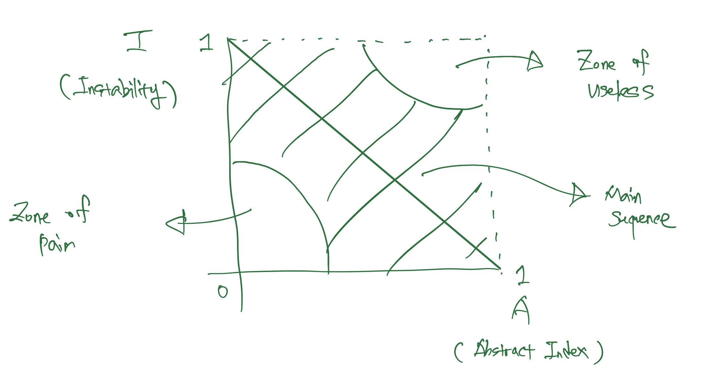

# DAY 8 - 2022-01-08

# 할 일

- 요구사항 재확인
- 코드를 살펴보면서 개선이 필요한 부분 정리
    - 정리할 때는 어떤 곳에 / 어떤 문제가 있어서 / 어떻게 개선을 해야한다 를 구체적으로 정리한다
- 요구사항에도 포함되고, 개선이 필요한 부분에도 포함되는 부분들을 추려낸다
- 해당 부분들을 추려낸 뒤, 전체적인 작업물의 퀄리티를 좌우하는 기준으로 우선순위를 정한다
- 우선순위대로 최대한 작업한다.
- 마지막 하루, 2022-01-09 일요일에는 코드 작업은 그만 한다고 생각한다.
    - 이유는, 문서화와 작업물에 대한 설명도 작성하는 코드만큼은 아니지만 일정 수준 이상의 시간은 할애해야 한다고 생각하기 때문이다.
    - 작업물에 대한 문서/기록화를 통한 명확한 설명은, 작업물을 확인하는 데 본인들의 소중한 시간을 사용하는 사람들에 대한 최소한의 예의라고 생각한다.

---

# 개발 요소 재확인
    
## 목적

‘만들었다’ 와 ‘요구사항에 맞춰서 만들었다’ 는 분명히 다른 영역이다. 먼저, ‘요구사항에 맞춰서 만들었다’ 를 위해서 요구사항을 다시 한 번 확인해 보기로 했다. 

## 개발 요소 항목 점검

### API setup

**REST API implementation**

- 완료여부: 완료
- 생각정리
    - 데이터베이스에 좀 더 높은 수준의 정규화를 적용하려고 하다보니, 예시로 준 JSON format 과는 약간 다른 response format 이 나왔다.
        - 굳이 할 일을 꼽자면, repository layer 에서 뽑아올린 database 에 담긴 값을 예시로 준 response format 에 맞추어 반환하는 convert method 를 만드는 것인데, 이는 후순위라고 생각한다.

`**better-sqlite3` 라이브러리를 이용한 SQL 기반의 데이터베이스 세팅**

- `TypeORM` 과 orm connection type 에 `better-sqlite3` 을 적용하였다.
- domain object 를 기반으로 만든 typeorm 의 entity 와 명시된 entity 간의 relation 을 통해, database - table 이 자동으로 생성되게끔 `syncronize: true` option 을 걸어놓았다.
    - 물론, production level 에서는 해당 값을 `false` 로 변경해 주어야 겠지만.
    
    **REST API 작성**
    
    - `GET /api/order` : 완료. 다만 이게 관리자 권한으로 모든 `order`(나는 `task` 라는 entity naming 을 사용하였지만) record 를 가져오는 건지, Authentication 을 통한 사용자 식별을 통해 해당 사용자의 주문 목록만을 가져오는건진 잘 모르겠다.
        - 그래서, 일단은 둘 다 만들어 놓긴 했다. 다만, 이걸 back office 에서도, application 에서도 재사용성을 높이기 위해서는 `user` 를 담는 `users` database table 을 설계할 때
            - `type` column 을 만든다.
                - `common`, `operator`, 그리고 `admin` 으로 사용자의 type 을 구분한다.
            - 혹은, 애초에 `common user` 들 만을 담는 table 과, `operator` 와 `admin` 과 같은 system user 들을 담는 table 을 별도로 설계한다.
            - 이렇게 구분된 사용자들에 맞추어서 사용자들을 구분할 수 있게 token 을 발행한다.
            - 해당 token 의 verify and decode result 로 routing 을 해준다.
        
        와 같은 방식으로 처리하면 될 거 같다. 그래도 그렇게 할 수 있는 여지 자체는 남겨놓았고, 전반적인 요구사항 충족과 중점사항을 기반으로 한 codebase 의 퀄리티 향상이 우선이기에 이는 굳이 지금 단계에서는 할 필요가 없다고 생각한다.
        
        - 추가로 user 쪽에서 수정이 필요한 부분을 발견하였다.
            1. `userUUID` 가 등록되지 않은 user record 들이 생성
            2. primary key 로 `uuid` 를 사용하겠다고 user entity 를 정의하였는데, `id` 라는 number type 의 auto increment 속성을 가진 column 이 primary key 가 되어있고, `userUUID` 라는 이름으로 별도의 `candidate key` 가 생성이 되어있다. 
    - `GET /api/order/:taskId` : 완료하였고, 위와 마찬가지인 고려사항이 남아있다.
    - `POST /api/order` : 완료하였다. ‘사용자’ 가 주문을 생성하는 것이니 `passport` 를 통한 authentication 을 거치고, 해당 사용자의 `uuid(cuid)` 를 기반으로 주문을 생성하는 방식으로 구현하였다.
    - `DELETE /api/order/:taskId` : 완료하였다. 다만 고려되는 부분은 hard delete 인지 soft delete 인지 모르겠다는 점이다. 일단은 soft delete 방식으로 구현하였다. soft delete 방식으로 구현한 이유는 2가지 이다.
        - rollback 등 state transition 등에서의 용이함
            - 특히 취소한 주문을 다시 할 수도 있는 상황, 혹은 취소된 주문을 기반으로 취소되었던 주문과 유사한 새로운 주문을 다시 만드는 상황을 고려하였다.
        - data-driven: 취소되었던 주문들을 데이터로 간주해서 효용을 이끌어 낼 여지도 남겨놓았다. 예를 들자면, 해당 주문 담는 데이터베이스에 취소사유(`deleted_reason`) column 등을 추가로 생성하는 경우 해당 데이터를 기반으로 취소된 주문들의 사유 분석을 하면서 추가적인 효용 창출을 할 수도 있지 않을까? 하는 생각이 들었다.
        

### **Response format setup**

- 진행하지 못 했다.
    - 그리고 이런 response format setup 과 같이 가야 하는 부분은
        - custom error definition
        - implement error handler and exception filter middleware
        - log system design
        
        과도 관련이 있다.
        
    - 일단 response format setup 을 main task 로, 나머지 것들은 해당 task 의 subtask 로 간주하여 issue 를 발행하자.
    
    ### **Authentication / Authorization process**
    
    - 완료여부: 완료
        - 장황하지 않은 설명으로 왜 이렇게 설계 / 구현을 하였는지에 대한 설명을 하는 과정이 추가로 필요할 것 같다.
            - 그러나, 이는 내일 문서화 작업에서 중점적으로 다루면 되는 부분으로 간주하는 게 좀 더 맞다고 생각하고, 전체적인 codebase quality 향상이 목적인 오늘 진행할 사항으로는 적절하지 않다고 생각이 든다.
    

---

# 주요 체크 포인트 재확인

    
## 목적

상술한 ‘만들었다’ 와 ‘요구사항에 맞춰서 만들었다’ 만큼, ‘만들었다’ 와 ‘잘 만들었다’ 는 분명히 다른 영역이다.  다른 영역이다. 이번엔 주요 체크포인트를 확인해서 좋은 작업물을 만들기 위해 작업물을 점검해보기로 하였다. 

## 주요 체크 포인트 목록

### 개발 요소들이 재사용될 수 있는 프로그래밍

**현재까지 한 일**

- 먼저 role, responsibility, method, 그리고 use cases 를 기반으로 domain object / entity 를 설계하였고, service layer 의 interface / abstract class 를 설계하였다.
- 위의 domain object / entity 를 기반으로 어떤 component 가 필요한지를 나누었다. 각 component 의 경우는 3 tier layer 를 기반으로 하였고, 그 세 개의 layer class 를 component 단위로 묶어내는 방식으로 구성하였다.
- 또한, SOLID 에 기반하여 각 component 의 layer 를 변경될 이유가 하나뿐일 수 있게끔 설계하였고, DI(`dependency injection`) pattern 을 통해서 각 layer 간의 의존성 또한 느슨하게 만들어주었다.
    - 그리고 이렇게 여러개의 service class 들을 `facade` pattern 을 통해 하나로 묶어내고 private method 로 내부적으로 처리를 하였다.
    - 다음으로는 facade pattern 처럼 private method 들을 사용하여 내부적인  처리 결과들을 조합한 뒤, 결과값을 반환하는, controller 에서 필요한 만큼의 public method 만을 남겨두는 식으로 (facade) service class 를 구성하였다.

**좀 더 점검하면 좋을 부분**

- service layer 와 repository layer 의 책임이 모호한 부분이 많아 수정이 필요하다는 생각이 든다.
    - 특히, `order` 같은 경우 막판에 빠르게 개발하려고 하다보니 책임 소재가 뒤죽박죽인 경우가 보인다. repository layer 는 database i/o 를 통해서 값을 가지고 오고, 그를 의미가 있는 domain object / entity 로 wrapping 해 주는 것이 해당 layer 의 책임이라고 생각하는데, service layer 에서 repository layer 의 책임을 가져가고 있는 부분들을 파악하였다.

### 확장성을 가진 프로젝트 구조

**현재까지 한 일**

- `SOLID` principle 에 맞추어 설계 / 구현을 진행하였다.
    - SOLID 는 좋은 아키텍처를 위한 원칙들인 Single Responsibility, Open-Closed, Liscov substitution, Interface segregation, Dependency Inversion 들로 만든 acronym 이다.
        - Single Responsibility: 하나의 class 가 바뀌어야 할 이유는 하나뿐이도록 설계를 하였다. 그렇게 해서 많아진 class 는 facade pattern 을 통해 캡슐화를 하면서 관리하였다. `facade.*.service.ts` 파일들이 해당 역할을 한다.
        - Open-Closed: 개방에는 열려있으나, 변화에는 폐쇄적이어야 한다. 이는 `abstract*`, `abstract{domainName}*`, `{domainName}*` 순으로 단계적 추상화를 진행하고, 해당 abstract class 들에서 반드시 갖추어야만 하는 abstract method 들을 정의함으로써 개방에는 자유롭게 (abstract class 에서 정의한 abstract method 만 구현하면, public / private 과 무관하게 method 들을 경우에 따라 확장이 가능하다), 수정에는 폐쇄적이게(abstarct method 를 통해 어떤 type의 input 이 들어가고, 어떤 type 의 output 이 나가는지를 정의해놓았기에, 수정을 하기엔 쉽지 않다) 시스템을 설계하였다.
        - Liscov Substitution: 이는 ‘농부의 자식 또한 농부의 아버지처럼 농사를 지을 수 있어야한다’ 라는 예시 설명이 가능한, 어떠한 class 가 parent class 의 subclass 이기 위해서는, parent class 대신 투입하여도 아무런 문제가 없이 기능을 수행해야 한다는 요구조건이 담긴 원칙이다
            - 해당 문제의 주요 원인은 복잡한 상속관계이다. 상속 관계가 복잡해지다 보면, 어떤 class 가 어떤 class 의 subclass 인지 어려워지고, 해당 principle 을 지키기가 어려워진다.
            - 그래서 이를 만족시키기 위해 코드를 작성할 때에는 abstract - concrete class 를 위한 extends 를 제외하곤 최대한 상속을 지양하였다. 상속을 통해 가져오는 의존성들은 의존성 주입 패턴(`Dependency Injection` pattern)으로 의존성을 외부에서 주입해주는 방식으로 해결하였다.
        - Interface Segregation: 사용하지 않는 method 를 가지고 있는 상황을 만들어서는 안 된다는 원칙이다. 이를 위해서 커다란 하나의 interface 를 다양한 interface 로 나누고, 이렇게 다양하게 나누어진 interface 들을 관리하기 위해 `(abstract) factory pattern` 을 활용하는데, 이번엔 interface 의 규모가 크지 않아서 추상화를 진행하고 concrete class 를 만들 때 하나의 abstract clsss 만을 활용하게 되어서 해당 원칙을 크게 위배하지는 않았다.
            - 또한, 이번 과제의 조건은 해당 원칙으로부터 자유롭기도 하다. 그 이유는 compiled language 가 아닌 script language 인 javascript 와 그의 superset 인 typescript 로 codebase 를 작성하고 있기 때문이다. Interface Segregation 은 사용하지 않는 method 들의 수정으로 인해, 불필요한 build - compile 이 이뤄지는 상황을 막아보자는 취지로 만든 요건이 큰데, 애초에 script language 에서는 build - compile 과정이 없으니 해당 문제로부터 상대적으로 자유로운 편이다.
                - 물론, `TypeScript` 라는 superset 은 compile 이 아닌 transpile 을 진행하긴 하지만, 상술한 것처럼 interface 의 규모가 아직까지는 크지 않다는 조건 덕에 codebase 가 해당 원칙을 위배하지는 않았다.
        - Dependency Inversion: 직역하자면 ‘의존성의 역전’ 이라는 말이다. 3 tier layer architecture 로 예시를 들자면, controller 는 service 에, service 는 repository 에 의존성을 가지고 있는 상태이다. 그러나, 의존하고 있는 layer 가 abstract class / interface 형식이라면, 앞에 말했던 경우의 의존성 방향과는 반대로 피 의존 layer 가 의존 layer 에게 어떤 concrete class 를 올려보내줄지를 지정해 주기 때문에, 의존성이 기존의 방향과 반대로 흘러가게 된다.
            - 해당 조건은 `abstract class` 를 통해 추상화를 진행하였기에 크게 위배하지 않고 codebase 를 작성할 수 있었다.
- concrete class 가 아닌, `abstract class` 를 기반으로 추상화를 진행하였다.
    - 그 덕분에 IoC(`Inversion of Control`) 이 용이해졌다.
        - IoC 가 용이해진 만큼 mocking 등이 쉬워져, 좀 더 테스트가 쉬운 구조를 만들었다.
            - 이를 통해 각 component 와 각 component 의 layer 를 작업할 때에는
                - test code 를 작성
                - test driven development 방식으로 작업
                
                을 좀 더 용이하게 할 수 있었다. 
                
    - 추상화와 테스트를 통해 확장성을 가진 프로젝트를 만들었다고 이야기하고 싶은 근거는 이렇다.
        - 추상화: injection 으로 주입한 type 들이 concrete class type 이 아니라 abstract class / interface type 이기에, type 을 반환하는 같은 method 들을 구현해 놓은 concrete class 라면 유연하게 교체가 가능하다.
        - 테스트: 테스트는 확장성을 확보했다기보다는 확장을 하는 데 드는 비용의 감소라는 효용을 가져다준다고 생각해서 확장성을 가진 프로젝트를 위한 노력으로 테스트를 기재해보았다. 그리고 원활한 test 를 위해서 하나의 함수가 하나의 역할만을 하게끔 method 를 설계하면, 재사용성 또한 자연스레 높아진다.

**좀 더 점검하면 좋을 부분**

- additional test code implementation: order component 와 해당 subcomponent 들은 time component 를 제외하고는 test code 를 작성하지 못 한 채로 구현에만 집중하여 test code 가 전무한 상황이다. 그리고 기존 abstract class 의 abstract method 를 수정하다 보니, 새롭게 추가해야 하는 test code 도 생겼다.
- 과도한 추상화를 하지 않았나 점검해보기:
    
    
    
    - no silver bullet (모든 상황에서 모든 걸 다 해결해주는 만능 해결책은 없다)라는 격언과 마찬가지로, 추상화라는 것이 어떤 상황에서든 ‘소프트’웨어를 유연하고 확장 가능한 구조로 만들어주는 만능 해결책은 절대로 아니다. 적절한 추상화 단계라는 게 필요하다.
    - 적절한 추상화 단계의 기준이란, ‘안정적일 수록 추상적이어야한다’ 라는 대 원칙에서 출발한다. 안정적이라는 것은 그만큼 많은 component 들이 해당 component 에 의존한다는 이야기이다. component 를 확장시켜야 하는 상황이 왔을 때, 해당 component 가 concrete component 라면 그 component 를 참조하는 다른 component 들을 전부 변경해 주어야 한다. 이런 상황에 지출해야 하는 비용을 줄이기 위해서 적절한 추상화라는 목표를 가지고 component 를 면밀히 점검하는 과정은 안정적인 아키텍처를 고려했을 때 매우 중요한 부분이다.
    - 해당 그림은 component level 에서 우리가 지양해야 할 추상화 정도와 지향해야 할 추상화 정도를 대략적으로 알려주는 척도라고 할 수 있다. 각 component 의 `(a, i)` 값이 저 main sequence 부근에 최대한 가깝게 위치하게끔 적절하게 추상화의 정도를 조절하라는 이야기이다.
        - 먼저, x 축에 있는 A(`abstract index`) 라는 값은 어떤 component 의 추상화 지표를 의미한다. 이는 $A = NumberOfConcreteClass / NumberOfAbstractClass + NumberOfInterface$
         라는 공식으로 해당 지표의 계산이 가능하다.
            - 다시 말해, 한 component 를 이루고 있는 concrete class 의 갯수를 한 component 의 abstact class + interface 의 갯수의 합으로 나누는 방식이다.
        - 그 다음으로, y 축에 있는 I(`instability`) 라는 값은 어떤 component 의 불안정성 지표를 의미한다.$Instability = Fan-out / Fan-out + Fan-in$ 라는 공식으로 해당 지표의 계산이 가능하다.
            - 해당 component 가 참조하는 component 를 fan-out, 해당 compoent 가 참조하는 component 의 갯수를 fan-in 이라고 한다.
            - 간단하게 말하자면, 해당 component 가 다른 component 들에 얼마나 많이 의존하고 있는지를 계산하는 계산식라고 할 수 있다. 의존받는 비중보다 의존하는 비중이 더 클 수록, 해당 component 는 불안정하다고 할 수 있다.
    - 나는 현재 기계적으로 각 layer 들을 abstract class 를 기반으로 추상화를 시켜놓았는데, 이게 적절한 수준의 추상화가 맞는지 점검해야 할 필요성은 있다는 생각이 들었다.
    

### 데이터베이스 구조화

**현재까지 한 일**

- 정규화
    - 정규화단계는 3.5 NF (Boyce-Codd NF) 까지 진행하였다. 이유는 데이터베이스에 담길 데이터들의 integrity 와 consistency 를 최대한 유지하기 위해서이다. 특히 transitive functional relation 관계가 있는 subset 들을 묶어서 별도의 table 로 분리하는 과정에 집중했었다.
        - 해당 과정의 대표적인 결과물은 주소(address)를 별도의 table 로 분리한 것이다. 분리한 이유는 [API Sample data](https://s3.ap-northeast-2.amazonaws.com/com.washswat.assets/dev/rn.json) 를 보았을 때, `address_01` 과 `address_02` 부분이 transitive functional relation 이 있다고 판단하였기 때문이다. `address_01`, 그러니까 흔히 우리가 일컫는 도로명 주소가 바뀌는 경우, `address_02`, 흔히 말 하는 동/호수를 적는 상세주소가 바뀔 확률은 매우 높다. 다른 위치에 같은 동/호수가 있는 경우가 아니라면 말이다. 그래서 `information` 이라는 data 를 구성하는 `address_01` 과 `address_02` 라는 두 개의 column을 별도의 `address` 로 분리하였다.
    - 이런 분리를 하게 된 이유가 또 하나 있는데, 바로 UX 관점이다. `user` 라는 table 과 `a user has many address` 라는 relation 을 만들어 주어야겠다는 생각을 하여서 자연스럽게 분리가 되었다.
        - 사용자의 입장에서는 이전에 주문을 했던 주소로 세탁 주문을 맡기고 싶을 때, 그 주소지를 주소지를 새로 입력해야 한다면 썩 유쾌한 경험은 아닐 것이라는 생각이 들었다. 그것보다는, 내가 이전에 주문했던 주소지 목록들 중에 하나를 선택해서 그 주소를 입력할 수 있다면, 수정하더라도, 그 주소를 불러와서 수정할 부분만 수정할 수 있다면, 더 이상 쓰지 않는다면, 내 주소지 목록에서 삭제할 수 있다면, 좀 더 편하지 않을까? 라는 생각으로 분리를 하게 된 이유도 있다.

- credential table
    - 그 다음으로는 `credentials` 라는 table 을 만든 것이다. 이는 access - refresh token pair 를 통해 인증을 진행하기 위해서 만든 table 이다. 해당 table 은 access token 이 만료가 되었을 경우, refresh token 을 통해 access - refresh token pair 를 갱신하고, 그 갱신된 결과를 담는 역할을 한다.
        - 부수적으로는, 사용자 별 마지막 로그인 날짜를 파악할 수 있는 역할도 한다. refresh token 은 ‘자동 로그인 주기’ 라는 UX 와 관련된 부분과 연관이 있다. 왜냐면, access token 을 통한 자동 로그인 주기가 끝났을 때, 다시 로그인을 하기 위해서는 refresh token 을 통해 새로 갱신을 해야 하기 때문이다. 그래서 refresh token 의 갱신일이 현 시점 - refresh token 만료일 보다 이전이라면, 이 사람은 최근에 애플리케이션을 잘 사용하지 않았고, 왜 잘 사용하지 않았는지에 대해 나머지 데이터를 통해 분석하면서 어떤 식으로 retention 을 진행해야 가장 효율적으로 진행할 수 있을 지에 대해 논의할 때 데이터를 기반으로 한 논의 (data driven decision) 가 가능해진다.
        

**좀 더 점검하면 좋을 부분들**

- ORM 사용으로 인한 trade off 파악 및 대책 보완
    - 우선, ORM 을 사용하면서 얻을 수 있는 장점은 다음과 같다.
        - 첫째로는 빠른 개발 속도이다. 아무래도 codebase 를 구성하는 프로그래밍 언어만으로 database io 의 대부분을 제어할 수 있다보니, 코드 중간중간마다 raw query 를 사용하는 것보다는 개발 속도가 빨라져서 product 를 빠른 속도로 만들어나갈 수 있다.
        - 자연스럽게 domain modeling 을 통해 만들어진 `entity` 가 곧 application 의 핵심이 된다.
        - database 를 통해 가져온 data 의 object mapping 이 library level 에서 자동으로 이뤄진다는 장점이 있다.
    - 그러나 단점이 있다. 바로 `N+1 problem` 이다.
        - 이 경우를 보완할 수 있는 방법은 여러가지가 있겠고, 고려해 볼 필요가 분명히 있다고 생각한다.

---

# 재확인을 통한 개선이 필요한 목록들

위의 요구사항 재분석을 통해서 더 필요한 부분이 무엇인지를 정리해보았다.

정리한 내용은 notion 의 표 기능을 통해서 
- 문제의 이름 
- 대분류 
- 소분류 
- 우선순위 
- 현 상황 
- 해결방안

을 작성하였고, 우선순위 순으로 정렬한 뒤에 `github issue` 를 등록하고, 해결하는 방식으로 진행해 나가고 있었다.

---

# 2022-01-08 작업 후기

- 개인적인 역량과 남은 시간을 생각해 보았을 때, 최대한 할 수 있는 것들은 다 했다고 생각한다. 과제 자체는 여기서 마무리할 예정이고, 이제 10일, 일요일은 진행했던 대해서 설명하고 정리하는 데 시간을 할당하려고 한다.

---

# DAY 8 - 2022-01-08 의 계획

- 문서화 진행